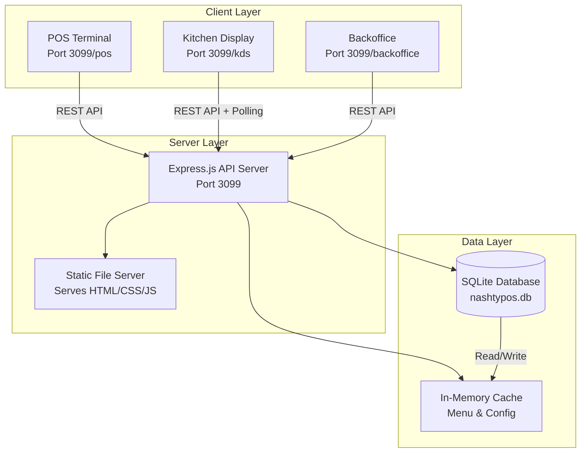
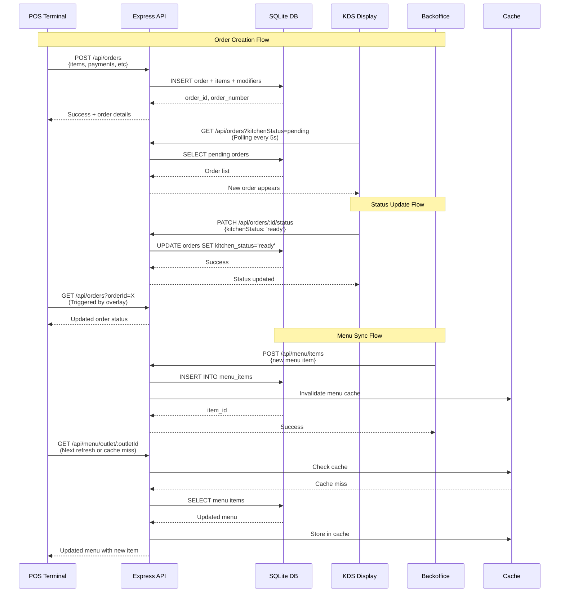
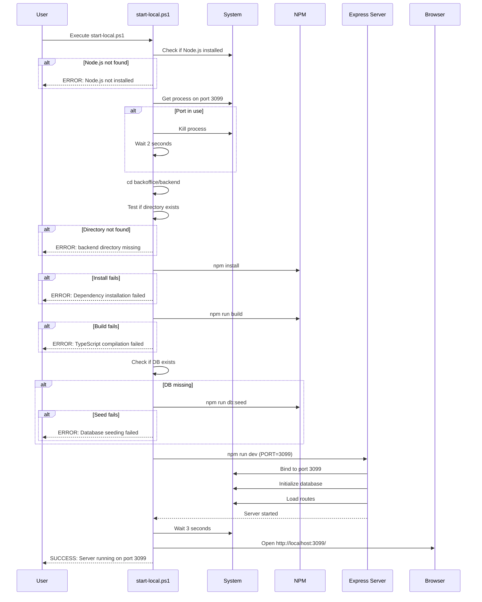
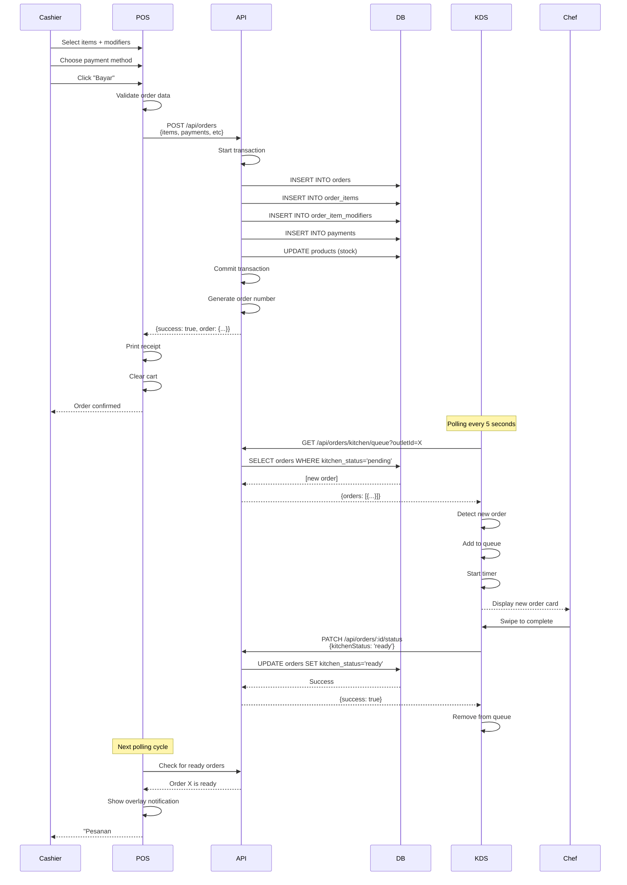
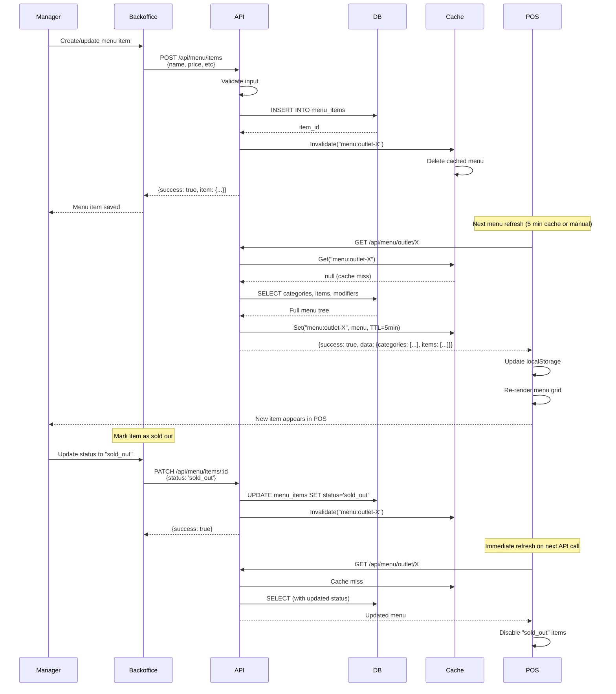

# Design Document: NASHTY OS Integration Fix

## Overview

This design addresses critical integration issues between the POS Terminal, Kitchen Display System (KDS), and Backoffice modules in the NASHTY OS restaurant management system. The system currently suffers from two major problems: (1) the local development environment setup script never works, causing 10+ hours of debugging time, and (2) the data flow between modules is broken, preventing real-time synchronization of orders, menu items, and status updates.

The solution provides a reliable local development workflow, establishes proper real-time data synchronization mechanisms, and ensures seamless integration between all three modules through a shared Express.js backend and SQLite database.

## Architecture

### High-Level System Architecture



### Data Flow Architecture



## Components and Interfaces

### Component 1: Local Development Script

**Purpose**: Provide a reliable, one-command local development environment setup

**Interface**:
```powershell
# PowerShell script: start-local.ps1
Function Start-NashtyOS {
    param(
        [int]$Port = 3099,
        [switch]$Clean,
        [switch]$SkipBuild
    )
    # Returns: Process handle for backend server
}
```

**Responsibilities**:
- Kill any existing process on target port (3099)
- Verify Node.js and npm are available
- Navigate to backend directory
- Install dependencies (npm install) with error handling
- Build TypeScript sources (npm run build) with error handling
- Initialize/seed database if not exists
- Start development server with proper environment variables
- Open browser after server is ready (health check)
- Provide clear error messages for each failure point

### Component 2: Express API Server

**Purpose**: Central API server handling all requests from POS, KDS, and Backoffice

**Interface**:
```typescript
interface APIServer {
  // Order Management
  createOrder(orderData: OrderRequest): Promise<OrderResponse>;
  getOrders(filters: OrderFilters): Promise<Order[]>;
  updateOrderStatus(orderId: string, status: StatusUpdate): Promise<void>;
  
  // Menu Management
  getMenuTree(outletId: string): Promise<MenuTree>;
  createMenuItem(item: MenuItemRequest): Promise<MenuItem>;
  updateMenuItem(itemId: string, updates: Partial<MenuItem>): Promise<void>;
  
  // Real-time Sync
  getOrdersForKDS(outletId: string, status: string): Promise<Order[]>;
  notifyMenuChange(outletId: string): Promise<void>;
  
  // Health & Config
  healthCheck(): Promise<HealthStatus>;
  getOutletConfig(outletId: string): Promise<OutletConfig>;
}
```

**Responsibilities**:
- Handle HTTP requests from all three modules
- Validate input data using Zod schemas
- Manage database transactions atomically
- Implement caching for frequently accessed data (menu, config)
- Provide consistent error responses
- Log all operations for debugging
- Serve static files for frontend modules

### Component 3: Database Manager

**Purpose**: Manage SQLite database operations with transaction support

**Interface**:
```typescript
interface DatabaseManager {
  // Transaction Management
  transaction<T>(fn: () => T): T;
  
  // Query Operations
  query<T>(sql: string, params: any[]): T[];
  get<T>(sql: string, params: any[]): T | null;
  run(sql: string, params: any[]): { changes: number };
  
  // Database Lifecycle
  initialize(): Promise<void>;
  saveToFile(): Promise<void>;
  backup(path: string): Promise<void>;
}
```

**Responsibilities**:
- Provide safe transaction boundaries for multi-table operations
- Implement debounced save mechanism (2s delay) to reduce disk I/O
- Ensure foreign key constraints are enabled
- Handle database initialization and schema migrations
- Provide consistent error handling for all operations
- Auto-save database after non-transaction operations

### Component 4: Cache Manager

**Purpose**: In-memory caching to reduce database load for frequently accessed data

**Interface**:
```typescript
interface CacheManager {
  get<T>(key: string): T | null;
  set<T>(key: string, value: T, ttl?: number): void;
  invalidate(key: string): void;
  invalidatePattern(pattern: string): void;
  clear(): void;
}
```

**Responsibilities**:
- Cache menu trees per outlet (TTL: 5 minutes)
- Cache outlet configuration (TTL: 10 minutes)
- Provide invalidation mechanism for cache coherence
- Implement pattern-based invalidation (e.g., "menu:*")
- Auto-cleanup of expired entries

### Component 5: KDS Polling Service

**Purpose**: Client-side polling mechanism for KDS to receive real-time updates

**Interface**:
```javascript
class KDSPollingService {
  constructor(outletId, pollInterval = 5000);
  start(callback);
  stop();
  forceRefresh();
  
  // Events
  onOrderReceived(order);
  onOrderUpdated(order);
  onConnectionError(error);
}
```

**Responsibilities**:
- Poll GET /api/orders/kitchen/queue every 5 seconds
- Detect new orders and updated orders
- Trigger UI updates with diff detection
- Handle network errors gracefully
- Implement exponential backoff on errors
- Display offline banner when connection fails

### Component 6: POS Menu Cache

**Purpose**: Client-side menu caching in POS to reduce API calls

**Interface**:
```javascript
class POSMenuCache {
  constructor(outletId);
  async getMenu();
  invalidate();
  isStale();
  
  // Events
  onMenuUpdated(menu);
  onCacheMiss();
}
```

**Responsibilities**:
- Store menu in localStorage
- Cache for 5 minutes before refresh
- Automatically refresh on app start
- Invalidate when Backoffice signals changes
- Provide stale-while-revalidate pattern

## Data Models

### Order Data Model

```typescript
interface Order {
  id: string;
  order_number: string;
  tenant_id: string;
  outlet_id: string;
  user_id: string;
  shift_id: string | null;
  order_type: 'dine-in' | 'takeaway' | 'gofood' | 'grabfood' | 'shopeefood';
  table_number: string | null;
  subtotal: number;
  discount: number;
  tax: number;
  service_charge: number;
  total: number;
  payment_method: string | null;
  payment_status: 'pending' | 'paid' | 'cancelled';
  order_status: 'pending' | 'confirmed' | 'preparing' | 'ready' | 'completed' | 'cancelled';
  kitchen_status: 'pending' | 'preparing' | 'ready' | 'served';
  notes: string | null;
  created_at: string;
  updated_at: string;
  completed_at: string | null;
  items: OrderItem[];
  payments: Payment[];
}
```

### MenuItem Data Model

```typescript
interface MenuItem {
  id: string;
  tenant_id: string;
  outlet_id: string;
  category_id: string;
  station_id: string | null;
  name: string;
  price: number;
  cost: number | null;
  sku: string | null;
  description: string | null;
  image_url: string | null;
  emoji: string | null;
  is_favorite: boolean;
  has_modifiers: boolean;
  stock_tracking: boolean;
  stock_qty: number;
  production_time: number;
  status: 'active' | 'inactive' | 'sold_out';
  created_at: string;
  updated_at: string;
  modifier_groups: ModifierGroup[];
}
```

### MenuTree Data Model

```typescript
interface MenuTree {
  categories: MenuCategory[];
  items: MenuItem[];
  modifierGroups: ModifierGroup[];
  stations: Station[];
}

interface MenuCategory {
  id: string;
  name: string;
  slug: string;
  emoji: string | null;
  color: string;
  display_order: number;
  status: 'active' | 'inactive';
}
```

### OutletConfig Data Model

```typescript
interface OutletConfig {
  outlet: {
    id: string;
    name: string;
    address: string;
    phone: string;
  };
  taxRate: number;
  taxEnabled: boolean;
  serviceChargeRate: number;
  serviceChargeEnabled: boolean;
  receiptHeader: string;
  receiptFooter: string;
  kdsWarnThreshold: number;
  kdsUrgentThreshold: number;
  paymentMethods: PaymentMethod[];
}
```

## Main Algorithm/Workflow

### Local Development Startup Workflow



### Order Creation and KDS Notification Workflow



### Menu Synchronization Workflow



## Error Handling

### Error Scenario 1: Port Already in Use

**Condition**: Another process is listening on port 3099 when trying to start the server  
**Response**: Script automatically kills the existing process using PowerShell's `Stop-Process`  
**Recovery**: Wait 2 seconds, verify port is free, then proceed with server startup

### Error Scenario 2: TypeScript Compilation Failure

**Condition**: `npm run build` exits with non-zero code due to TypeScript errors  
**Response**: Script displays clear error message with build output, halts execution  
**Recovery**: User must fix TypeScript errors manually, then re-run script

### Error Scenario 3: Database Initialization Failure

**Condition**: Database file is corrupted or schema.sql has syntax errors  
**Response**: Server logs detailed error, creates backup of corrupted DB, attempts fresh initialization  
**Recovery**: If fresh init fails, display instructions to manually delete nashtypos.db and re-seed

### Error Scenario 4: Network Connection Lost (KDS)

**Condition**: KDS polling receives network error or timeout  
**Response**: Display offline banner, pause polling, implement exponential backoff (5s, 10s, 20s, 30s max)  
**Recovery**: Once network restored, resume polling at normal interval, refresh queue

### Error Scenario 5: Stale Menu Data in POS

**Condition**: POS cache is older than 5 minutes or Backoffice signals invalidation  
**Response**: Force API call to /api/menu/outlet/:outletId, bypass cache  
**Recovery**: Update localStorage with fresh data, re-render menu grid, notify user if items changed

### Error Scenario 6: Order Creation Fails Mid-Transaction

**Condition**: Database constraint violation or disk full during order insertion  
**Response**: Rollback entire transaction, no partial order saved  
**Recovery**: Return error to POS with specific message, preserve cart state, allow user to retry

### Error Scenario 7: Concurrent Order Number Generation

**Condition**: Two cashiers submit orders at exact same millisecond  
**Response**: Use database sequence or nanoid for guaranteed uniqueness  
**Recovery**: No user action needed, system handles automatically

## Testing Strategy

### Unit Testing Approach

**Scope**: Individual functions and components in isolation

**Key Test Cases**:
- Database transaction rollback on error
- Cache invalidation logic
- Order number generation uniqueness
- Menu tree assembly from database rows
- Polling service state management
- Error response formatting

**Coverage Goals**: 80% code coverage for backend routes and database layer

**Tools**: Jest for unit tests, in-memory SQLite for database tests

### Integration Testing Approach

**Scope**: End-to-end workflows across multiple components

**Key Test Scenarios**:
1. **Order Creation Flow**: POS creates order → Database persisted → KDS receives via polling
2. **Menu Sync Flow**: Backoffice updates menu → Cache invalidated → POS receives update
3. **Status Update Flow**: KDS marks ready → Database updated → POS receives notification
4. **Multi-Outlet Isolation**: Orders from outlet A don't appear in outlet B's KDS
5. **Split Payment**: Order with multiple payment methods saves correctly
6. **Shift Management**: Shift open → Orders created → Shift close with correct summary

**Tools**: Supertest for API testing, Playwright for E2E browser tests

### Manual Testing Checklist

- [ ] Run start-local.ps1 on fresh clone (no node_modules)
- [ ] Verify server starts and browser opens automatically
- [ ] Create order in POS, verify appears in KDS within 5 seconds
- [ ] Mark order ready in KDS, verify overlay appears in POS
- [ ] Add menu item in Backoffice, verify appears in POS within 5 minutes
- [ ] Mark item sold out, verify POS disables item
- [ ] Kill server mid-order, restart, verify database intact
- [ ] Test with 2 browsers (POS + KDS) simultaneously
- [ ] Verify port conflict handling (start server twice)

## Performance Considerations

### Database Performance

**Requirement**: Support 100+ orders per hour per outlet without lag

**Optimizations**:
- Use WAL (Write-Ahead Logging) mode for SQLite to allow concurrent reads during writes
- Implement debounced save (2s delay) to batch writes
- Create indexes on frequently queried columns: `orders.kitchen_status`, `orders.outlet_id`, `orders.created_at`
- Use prepared statements to avoid SQL parsing overhead

**Metrics to Monitor**:
- Average query time: < 10ms for reads, < 50ms for writes
- Database file size growth: ~1MB per 1000 orders
- Transaction success rate: > 99.9%

### API Response Times

**Requirement**: 95th percentile response time < 200ms

**Optimizations**:
- Implement caching for menu data (5 min TTL)
- Implement caching for outlet config (10 min TTL)
- Use query result streaming for large order lists
- Paginate order history endpoints (default limit: 50)

**Metrics to Monitor**:
- Average response time per endpoint
- Cache hit ratio: > 80% for menu endpoints
- 95th percentile response time: < 200ms
- 99th percentile response time: < 500ms

### KDS Polling Efficiency

**Requirement**: Minimize network traffic while maintaining real-time feel

**Optimizations**:
- Poll every 5 seconds (balance between real-time and bandwidth)
- Use conditional requests (If-Modified-Since headers) to return 304 Not Modified when no changes
- Implement diff detection client-side to only update changed orders
- Use gzip compression for API responses

**Metrics to Monitor**:
- Network requests per minute: ~12 (polling every 5s)
- Average payload size: < 5KB per response
- UI update latency: < 100ms from data received to screen rendered

### Frontend Performance

**Requirement**: POS menu grid renders < 1 second even with 100+ items

**Optimizations**:
- Use virtual scrolling for long item lists
- Lazy load images with placeholder
- Debounce search input (300ms delay)
- Cache rendered DOM elements

**Metrics to Monitor**:
- Initial load time: < 2 seconds
- Menu render time: < 1 second
- Cart update latency: < 50ms
- Search result latency: < 300ms

## Security Considerations

### Authentication Security

**Threat**: Unauthorized access to POS/KDS/Backoffice

**Mitigation**:
- Implement PIN authentication with bcrypt hashing (cost factor: 10)
- Enforce role-based access control (cashier, chef, manager, owner)
- Implement session timeout (12 hours for POS, 30 minutes for Backoffice)
- Lock account after 3 failed PIN attempts for 5 minutes
- Use JWT tokens for API authentication (not yet enabled, ready for production)

### Data Validation Security

**Threat**: SQL injection, XSS attacks, price manipulation

**Mitigation**:
- Use parameterized queries exclusively (no string concatenation)
- Implement XSS sanitization middleware using `xss` library
- Validate all inputs using Zod schemas
- Server-side price calculation (never trust client-sent prices)
- Verify payment total matches calculated total

### Database Security

**Threat**: Data corruption, unauthorized file access

**Mitigation**:
- Enable SQLite foreign key constraints
- Implement atomic transactions for multi-table operations
- Automatic database backups before risky operations
- File permissions: read/write only for server process user
- Daily automated backups to separate directory

### Network Security

**Threat**: Man-in-the-middle attacks, data interception

**Mitigation**:
- Use HTTPS in production (Let's Encrypt certificates)
- Implement CORS with specific allowed origins
- Rate limiting per IP: 100 requests per minute
- Sanitize all error messages (no stack traces in production)
- Log all suspicious activities

## Dependencies

### Backend Dependencies

```json
{
  "express": "^4.18.2",
  "cors": "^2.8.5",
  "dotenv": "^16.6.1",
  "sql.js": "^1.10.3",
  "bcryptjs": "^2.4.3",
  "jsonwebtoken": "^9.0.3",
  "nanoid": "^5.0.4",
  "zod": "^3.22.4",
  "xss": "^1.0.15"
}
```

### DevDependencies

```json
{
  "typescript": "^5.3.3",
  "tsx": "^4.7.0",
  "@types/node": "^20.10.6",
  "@types/express": "^4.17.21",
  "@types/cors": "^2.8.17",
  "@types/bcryptjs": "^2.4.6",
  "@types/jsonwebtoken": "^9.0.5"
}
```

### System Requirements

- Node.js: v18.x or higher
- npm: v9.x or higher
- Operating System: Windows 10/11 (primary), macOS, Linux (secondary)
- Available RAM: 2GB minimum, 4GB recommended
- Disk Space: 500MB minimum for node_modules + database

### External Services (Optional)

- Supabase: For cloud database and auth (future migration)
- Cloudflare Workers: For production deployment (future)
- Cloudflare Pages: For frontend hosting (future)

### Browser Requirements

- Chrome/Edge: v100+ (required for WebUSB thermal printer support)
- Firefox: v110+ (POS without printer works)
- Safari: v16+ (POS without printer works)

## Implementation Notes

### Critical Fixes for start-local.bat

**Problem Analysis**: The current batch script has several failure points:
1. Port killing uses `netstat` which may not reliably find all processes
2. No verification that port is actually freed before proceeding
3. No error handling for `npm install` or `npm run build` failures
4. No health check before opening browser (browser opens before server ready)
5. Database seeding runs every time, even when DB exists
6. No clear error messages for each failure point

**Solution**: Rewrite as PowerShell script with proper error handling at each step

### Real-time Update Strategy

**Decision**: Use polling instead of WebSockets for initial implementation

**Rationale**:
- Simpler to implement and debug
- No additional server dependencies (socket.io, ws)
- Works reliably across all network configurations
- 5-second polling is acceptable for KDS use case
- Can upgrade to WebSockets later without changing data models

**Future Upgrade Path**: Add Server-Sent Events (SSE) endpoint for push notifications

### Cache Invalidation Strategy

**Pattern**: Cache-Aside with TTL and explicit invalidation

**Implementation**:
1. On read: Check cache → if miss, query DB → store in cache with TTL
2. On write: Update DB → explicitly invalidate related cache keys
3. On TTL expire: Next read causes cache miss and refresh

**Cache Keys**:
- `menu:outlet:{outletId}` - Full menu tree (TTL: 5 min)
- `config:outlet:{outletId}` - Outlet configuration (TTL: 10 min)
- `orders:pending:{outletId}` - KDS queue snapshot (TTL: 5 sec)

### Database Transaction Boundaries

**Critical Operations Requiring Transactions**:
1. Order creation (orders + order_items + modifiers + payments + stock updates)
2. Shift close (shift update + order summary calculation)
3. Menu item creation (item + modifier_group associations + cache invalidation)

**Non-Transactional Operations**:
1. Read-only queries (SELECT)
2. Single-row updates (order status change)
3. Log entries (activity_logs)

### Logging Strategy

**Log Levels**:
- ERROR: System failures requiring immediate attention
- WARN: Potential issues or degraded performance
- INFO: Normal operational events (server start, order created)
- DEBUG: Detailed diagnostic information

**What to Log**:
- All API requests (method, path, status, duration)
- Database errors and slow queries (> 100ms)
- Order creation and status changes
- Menu updates and cache invalidations
- Authentication attempts (success and failure)
- Port conflicts and recovery attempts

**Log Format**:
```
[2024-06-11T10:30:45.123Z] [INFO] POST /api/orders - 201 - 45ms - Order SNY-0601-001 created
[2024-06-11T10:30:50.456Z] [WARN] Database query slow - SELECT orders - 150ms
[2024-06-11T10:31:00.789Z] [ERROR] Port 3099 in use - killing PID 12345
```

### Migration Path from Current State

**Phase 1: Fix Local Development** (Week 1)
1. Create new start-local.ps1 with proper error handling
2. Test on fresh clone without node_modules
3. Document all error cases and recovery steps

**Phase 2: Implement Caching** (Week 1-2)
1. Create CacheManager class
2. Add cache layer to menu endpoint
3. Add cache layer to config endpoint
4. Implement cache invalidation on updates

**Phase 3: Optimize KDS Polling** (Week 2)
1. Create optimized /api/orders/kitchen/queue endpoint
2. Implement client-side diff detection
3. Add exponential backoff on errors
4. Add offline banner

**Phase 4: Testing & Validation** (Week 2-3)
1. Write unit tests for cache manager
2. Write integration tests for order flow
3. Perform manual testing with 2+ concurrent users
4. Load test with 100 orders per hour

**Phase 5: Documentation & Deployment** (Week 3)
1. Update README with new startup instructions
2. Create troubleshooting guide
3. Record demo video of working system
4. Deploy to staging environment
