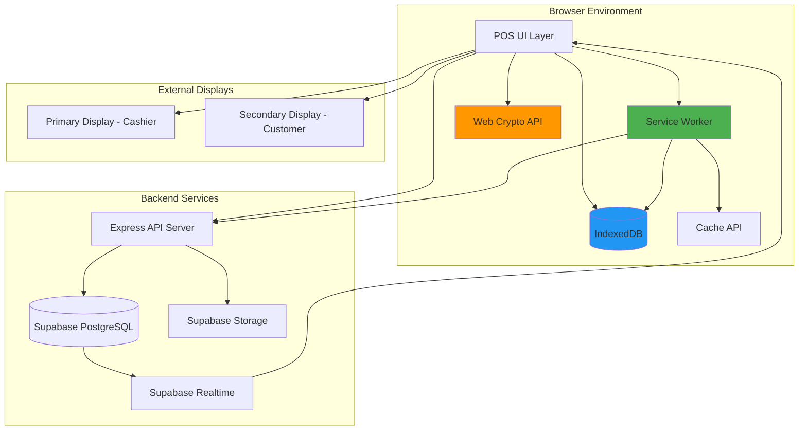
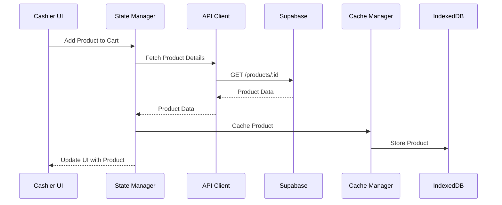
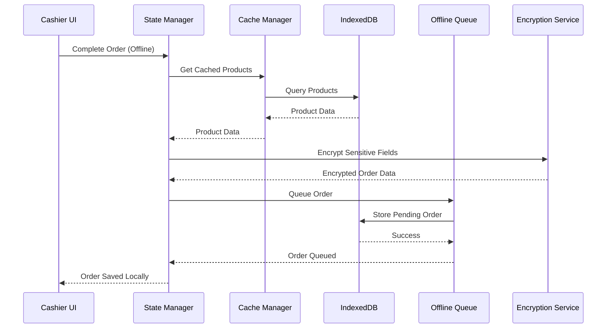
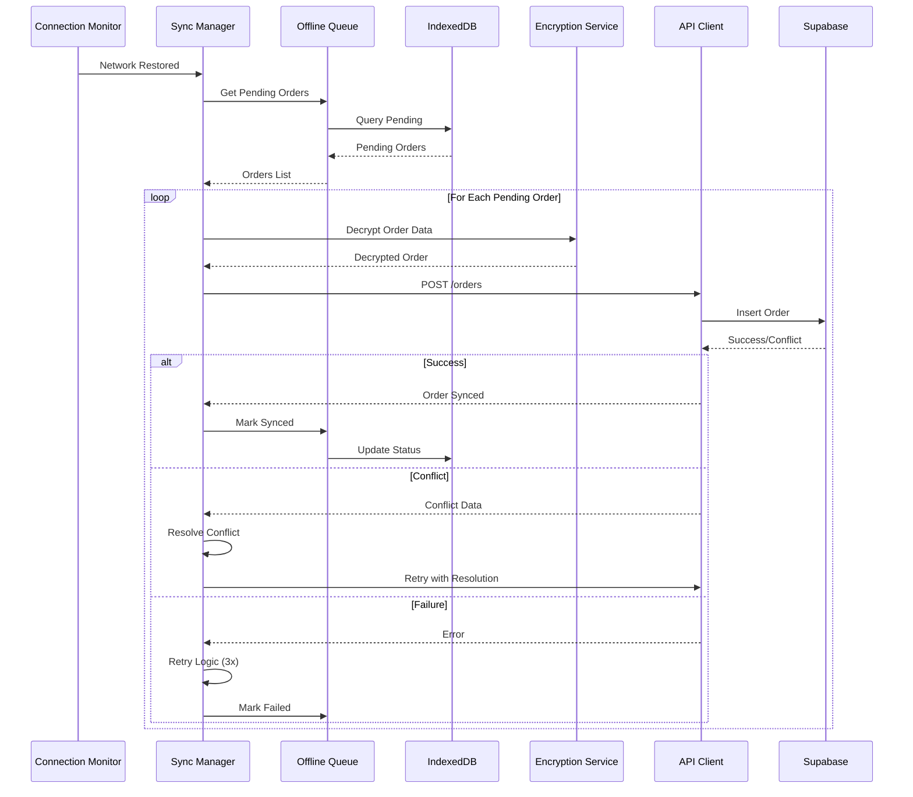

# Design Document: POS Enhancement to Perfect

## Overview

This design document specifies the technical architecture, components, and implementation strategy for enhancing the Nashty OS Point of Sale (POS) system from 95/100 to a PERFECT 100/100 score. The enhancement introduces five critical features: **Offline Mode**, **Favorites/Quick Access**, **Keyboard Shortcuts**, **Receipt Customization**, and **Customer Display (Secondary Screen)**.

### Design Goals

1. **Reliability**: Enable seamless operation during network outages without data loss
2. **Speed**: Reduce transaction time through favorites and keyboard shortcuts
3. **Usability**: Improve cashier workflow and customer transparency
4. **Branding**: Allow outlets to customize receipts and displays
5. **Security**: Protect sensitive data stored locally with encryption
6. **Compatibility**: Maintain backwards compatibility with existing multi-tenant architecture

### Technology Stack

- **Frontend**: Vanilla JavaScript (ES2020+), HTML5, CSS3
- **Service Worker**: Workbox 7.x for offline capabilities
- **Local Storage**: IndexedDB (via idb library v8.x)
- **Backend**: Node.js + Express, Supabase PostgreSQL
- **Real-time**: Supabase Realtime (WebSocket)
- **Cloud Storage**: Supabase Storage for images/logos
- **Encryption**: Web Crypto API (AES-256-GCM)
- **Multi-Screen**: Window Management API (with fallback)

### Key Design Principles

1. **Offline-First Architecture**: Local-first with eventual consistency
2. **Progressive Enhancement**: Core POS functionality works in all browsers
3. **Security by Design**: Encrypt sensitive data at rest and in transit
4. **Performance**: Sub-second response times for all operations
5. **Testability**: Property-based testing for critical data flows

---

## Architecture

### High-Level System Architecture



### Layered Architecture

```
┌─────────────────────────────────────────────────────────────┐
│                    Presentation Layer                        │
│  ┌────────────┐  ┌────────────┐  ┌────────────────────────┐│
│  │ POS UI     │  │ Quick      │  │ Customer Display       ││
│  │ Components │  │ Access Grid│  │ (Secondary Window)     ││
│  └────────────┘  └────────────┘  └────────────────────────┘│
└─────────────────────────────────────────────────────────────┘
                           ↓
┌─────────────────────────────────────────────────────────────┐
│                    Application Layer                         │
│  ┌────────────┐  ┌────────────┐  ┌────────────────────────┐│
│  │ State      │  │ Sync       │  │ Keyboard Shortcut      ││
│  │ Manager    │  │ Manager    │  │ Handler                ││
│  └────────────┘  └────────────┘  └────────────────────────┘│
│  ┌────────────┐  ┌────────────┐  ┌────────────────────────┐│
│  │ Receipt    │  │ Favorites  │  │ Connection             ││
│  │ Generator  │  │ Manager    │  │ Monitor                ││
│  └────────────┘  └────────────┘  └────────────────────────┘│
└─────────────────────────────────────────────────────────────┘
                           ↓
┌─────────────────────────────────────────────────────────────┐
│                    Service Layer                             │
│  ┌────────────┐  ┌────────────┐  ┌────────────────────────┐│
│  │ Service    │  │ Cache      │  │ Encryption             ││
│  │ Worker     │  │ Manager    │  │ Service                ││
│  └────────────┘  └────────────┘  └────────────────────────┘│
│  ┌────────────┐  ┌────────────┐  ┌────────────────────────┐│
│  │ Offline    │  │ Conflict   │  │ API Client             ││
│  │ Queue      │  │ Resolver   │  │                        ││
│  └────────────┘  └────────────┘  └────────────────────────┘│
└─────────────────────────────────────────────────────────────┘
                           ↓
┌─────────────────────────────────────────────────────────────┐
│                    Data Layer                                │
│  ┌────────────┐  ┌────────────┐  ┌────────────────────────┐│
│  │ IndexedDB  │  │ Cache API  │  │ Supabase API           ││
│  └────────────┘  └────────────┘  └────────────────────────┘│
└─────────────────────────────────────────────────────────────┘
```

### Data Flow Architecture

#### Online Mode Data Flow



#### Offline Mode Data Flow



#### Sync Process Data Flow



---

## Components and Interfaces

### 1. Service Worker

**Purpose**: Enable offline functionality by intercepting network requests and serving cached responses.

**Implementation Strategy**: Use Workbox for battle-tested caching strategies.

#### Service Worker Registration

```javascript
// sw-register.js
class ServiceWorkerManager {
  constructor() {
    this.registration = null;
    this.updateAvailable = false;
  }

  async register() {
    if (!('serviceWorker' in navigator)) {
      console.warn('Service Worker not supported');
      return null;
    }

    try {
      this.registration = await navigator.serviceWorker.register('/sw.js', {
        scope: '/',
        updateViaCache: 'none'
      });

      // Check for updates every 5 minutes
      setInterval(() => {
        this.registration.update();
      }, 5 * 60 * 1000);

      // Listen for updates
      this.registration.addEventListener('updatefound', () => {
        this.handleUpdate(this.registration.installing);
      });

      return this.registration;
    } catch (error) {
      console.error('Service Worker registration failed:', error);
      return null;
    }
  }

  handleUpdate(worker) {
    worker.addEventListener('statechange', () => {
      if (worker.state === 'installed' && navigator.serviceWorker.controller) {
        this.updateAvailable = true;
        this.notifyUpdateAvailable();
      }
    });
  }

  notifyUpdateAvailable() {
    const canUpdate = !this.hasPendingOrders() && !this.hasActiveCart();
    
    if (canUpdate) {
      this.showUpdatePrompt();
    } else {
      // Defer update - re-check in 30 minutes
      setTimeout(() => this.notifyUpdateAvailable(), 30 * 60 * 1000);
    }
  }

  hasP
endingOrders() {
    return window.offlineQueue?.getPendingCount() > 0;
  }

  hasActiveCart() {
    return window.stateManager?.hasItemsInCart() || false;
  }

  showUpdatePrompt() {
    const modal = document.getElementById('update-modal');
    modal.style.display = 'block';
  }

  async activateUpdate() {
    if (this.registration?.waiting) {
      this.registration.waiting.postMessage({ type: 'SKIP_WAITING' });
      window.location.reload();
    }
  }
}
```

#### Service Worker Implementation (Workbox)

```javascript
// sw.js
importScripts('https://storage.googleapis.com/workbox-cdn/releases/7.0.0/workbox-sw.js');

const { registerRoute, setDefaultHandler, setCatchHandler } = workbox.routing;
const { CacheFirst, NetworkFirst, StaleWhileRevalidate } = workbox.strategies;
const { CacheableResponsePlugin } = workbox.cacheableResponse;
const { ExpirationPlugin } = workbox.expiration;
const { BackgroundSyncPlugin } = workbox.backgroundSync;

// Cache static assets with Cache First strategy
registerRoute(
  ({ request }) => request.destination === 'style' ||
                   request.destination === 'script' ||
                   request.destination === 'font',
  new CacheFirst({
    cacheName: 'static-assets-v1',
    plugins: [
      new CacheableResponsePlugin({ statuses: [0, 200] }),
      new ExpirationPlugin({ maxEntries: 60, maxAgeSeconds: 30 * 24 * 60 * 60 })
    ]
  })
);

// Cache product images with Stale While Revalidate
registerRoute(
  ({ request }) => request.destination === 'image',
  new StaleWhileRevalidate({
    cacheName: 'images-v1',
    plugins: [
      new CacheableResponsePlugin({ statuses: [0, 200] }),
      new ExpirationPlugin({ maxEntries: 200, maxAgeSeconds: 7 * 24 * 60 * 60 })
    ]
  })
);

// API calls with Network First + Background Sync
const bgSyncPlugin = new BackgroundSyncPlugin('orders-queue', {
  maxRetentionTime: 24 * 60 // Retry for up to 24 hours
});

registerRoute(
  ({ url }) => url.pathname.startsWith('/api/'),
  new NetworkFirst({
    cacheName: 'api-cache-v1',
    networkTimeoutSeconds: 10,
    plugins: [
      bgSyncPlugin,
      new CacheableResponsePlugin({ statuses: [0, 200] })
    ]
  })
);

// Handle app shell with Cache First
registerRoute(
  ({ request }) => request.mode === 'navigate',
  new CacheFirst({
    cacheName: 'app-shell-v1',
    plugins: [
      new CacheableResponsePlugin({ statuses: [200] })
    ]
  })
);

// Listen for skip waiting message
self.addEventListener('message', (event) => {
  if (event.data?.type === 'SKIP_WAITING') {
    self.skipWaiting();
  }
});

// Clean up old caches on activation
self.addEventListener('activate', (event) => {
  const cacheWhitelist = ['static-assets-v1', 'images-v1', 'api-cache-v1', 'app-shell-v1'];
  event.waitUntil(
    caches.keys().then((cacheNames) => {
      return Promise.all(
        cacheNames.map((cacheName) => {
          if (!cacheWhitelist.includes(cacheName)) {
            return caches.delete(cacheName);
          }
        })
      );
    })
  );
});
```

**Cache Strategy Rationale**:
- **Static Assets (Cache First)**: HTML/CSS/JS rarely change, prioritize speed
- **Images (Stale While Revalidate)**: Show cached images immediately, update in background
- **API (Network First)**: Always try network first for freshest data, fall back to cache if offline
- **Navigation (Cache First)**: App shell loads instantly from cache


### 2. IndexedDB Schema

**Purpose**: Store products, categories, settings, pending orders, and user preferences locally.

**Library**: Use `idb` (v8.x) - a promise-based IndexedDB wrapper.

#### Database Schema

```javascript
// db-schema.js
import { openDB } from 'idb';

const DB_NAME = 'nashty-pos';
const DB_VERSION = 1;

export async function initDatabase() {
  return await openDB(DB_NAME, DB_VERSION, {
    upgrade(db, oldVersion, newVersion, transaction) {
      // Products store
      if (!db.objectStoreNames.contains('products')) {
        const productStore = db.createObjectStore('products', { keyPath: 'id' });
        productStore.createIndex('categoryId', 'categoryId', { unique: false });
        productStore.createIndex('outletId', 'outletId', { unique: false });
        productStore.createIndex('name', 'name', { unique: false });
        productStore.createIndex('updatedAt', 'updatedAt', { unique: false });
      }

      // Categories store
      if (!db.objectStoreNames.contains('categories')) {
        const categoryStore = db.createObjectStore('categories', { keyPath: 'id' });
        categoryStore.createIndex('outletId', 'outletId', { unique: false });
        categoryStore.createIndex('name', 'name', { unique: false });
      }

      // Offline queue store
      if (!db.objectStoreNames.contains('offline_queue')) {
        const queueStore = db.createObjectStore('offline_queue', { keyPath: 'localId', autoIncrement: true });
        queueStore.createIndex('timestamp', 'timestamp', { unique: false });
        queueStore.createIndex('status', 'status', { unique: false });
        queueStore.createIndex('orderType', 'orderType', { unique: false });
      }

      // Favorites store
      if (!db.objectStoreNames.contains('favorites')) {
        const favStore = db.createObjectStore('favorites', { keyPath: ['userId', 'productId'] });
        favStore.createIndex('userId', 'userId', { unique: false });
        favStore.createIndex('position', 'position', { unique: false });
        favStore.createIndex('createdAt', 'createdAt', { unique: false });
      }

      // Recent items store
      if (!db.objectStoreNames.contains('recent_items')) {
        const recentStore = db.createObjectStore('recent_items', { keyPath: ['userId', 'productId'] });
        recentStore.createIndex('userId', 'userId', { unique: false });
        recentStore.createIndex('lastUsedAt', 'lastUsedAt', { unique: false });
        recentStore.createIndex('usageCount', 'usageCount', { unique: false });
      }

      // Keyboard shortcuts store
      if (!db.objectStoreNames.contains('keyboard_shortcuts')) {
        const shortcutStore = db.createObjectStore('keyboard_shortcuts', { keyPath: ['userId', 'keyCombo'] });
        shortcutStore.createIndex('userId', 'userId', { unique: false });
        shortcutStore.createIndex('action', 'action', { unique: false });
      }

      // Settings store (outlet-level settings)
      if (!db.objectStoreNames.contains('settings')) {
        const settingsStore = db.createObjectStore('settings', { keyPath: ['outletId', 'key'] });
        settingsStore.createIndex('outletId', 'outletId', { unique: false });
      }

      // Encryption keys store (session-based)
      if (!db.objectStoreNames.contains('encryption_keys')) {
        const keyStore = db.createObjectStore('encryption_keys', { keyPath: 'userId' });
      }
    }
  });
}
```


#### Data Models

**Product Model**:
```typescript
interface Product {
  id: string;
  outletId: string;
  categoryId: string;
  name: string;
  description: string;
  price: number;
  image: string | null;
  isActive: boolean;
  stock: number | null;
  sku: string | null;
  modifiers: Modifier[];
  createdAt: string;
  updatedAt: string;
}
```

**Offline Queue Item**:
```typescript
interface OfflineQueueItem {
  localId?: number; // Auto-incremented
  timestamp: number; // Unix timestamp in ms
  status: 'pending' | 'synced' | 'failed';
  orderType: 'order' | 'favorite' | 'setting';
  data: string; // Encrypted JSON string
  retryCount: number;
  lastError: string | null;
  userId: string;
  outletId: string;
}
```

**Favorite Item**:
```typescript
interface FavoriteItem {
  userId: string;
  productId: string;
  position: number; // For ordering
  createdAt: string;
}
```

**Recent Item**:
```typescript
interface RecentItem {
  userId: string;
  productId: string;
  lastUsedAt: string;
  usageCount: number;
}
```

**Keyboard Shortcut**:
```typescript
interface KeyboardShortcut {
  userId: string;
  keyCombo: string; // e.g., "Ctrl+P", "F1"
  action: string; // e.g., "openPayment", "clearCart"
  productId: string | null; // For product shortcuts
  isCustom: boolean;
}
```


### 3. Cache Manager

**Purpose**: Synchronize data between Supabase and IndexedDB, manage cache expiry.

```javascript
// cache-manager.js
export class CacheManager {
  constructor(db, apiClient) {
    this.db = db;
    this.apiClient = apiClient;
    this.syncInterval = 5 * 60 * 1000; // 5 minutes
    this.maxProducts = 10000;
    this.syncTimer = null;
  }

  async startSync() {
    // Initial sync
    await this.syncAll();

    // Periodic sync
    this.syncTimer = setInterval(() => {
      if (navigator.onLine) {
        this.syncAll();
      }
    }, this.syncInterval);
  }

  stopSync() {
    if (this.syncTimer) {
      clearInterval(this.syncTimer);
      this.syncTimer = null;
    }
  }

  async syncAll() {
    try {
      await Promise.all([
        this.syncProducts(),
        this.syncCategories(),
        this.syncSettings()
      ]);
    } catch (error) {
      console.error('Cache sync failed:', error);
    }
  }

  async syncProducts() {
    const outletId = this.getCurrentOutletId();
    const lastSync = await this.getLastSyncTime('products');

    // Fetch updated products from server
    const products = await this.apiClient.get('/products', {
      params: {
        outletId,
        updatedAfter: lastSync
      }
    });

    // Update IndexedDB
    const tx = this.db.transaction('products', 'readwrite');
    const store = tx.objectStore('products');

    for (const product of products) {
      await store.put(product);
    }

    await tx.done;

    // Check product count and enforce limit
    const count = await store.count();
    if (count > this.maxProducts) {
      await this.pruneOldProducts(count - this.maxProducts);
    }

    await this.setLastSyncTime('products', Date.now());
  }

  async syncCategories() {
    const outletId = this.getCurrentOutletId();
    const categories = await this.apiClient.get('/categories', {
      params: { outletId }
    });

    const tx = this.db.transaction('categories', 'readwrite');
    const store = tx.objectStore('categories');

    for (const category of categories) {
      await store.put(category);
    }

    await tx.done;
  }

  async syncSettings() {
    const outletId = this.getCurrentOutletId();
    const settings = await this.apiClient.get('/settings', {
      params: { outletId }
    });

    const tx = this.db.transaction('settings', 'readwrite');
    const store = tx.objectStore('settings');

    for (const [key, value] of Object.entries(settings)) {
      await store.put({ outletId, key, value });
    }

    await tx.done;
  }

  async pruneOldProducts(countToRemove) {
    const tx = this.db.transaction('products', 'readwrite');
    const store = tx.objectStore('products');
    const index = store.index('updatedAt');

    const oldProducts = await index.getAll(null, countToRemove);

    for (const product of oldProducts) {
      await store.delete(product.id);
    }

    await tx.done;
  }

  async getCachedProduct(productId) {
    const tx = this.db.transaction('products', 'readonly');
    const store = tx.objectStore('products');
    return await store.get(productId);
  }

  async searchCachedProducts(query) {
    const tx = this.db.transaction('products', 'readonly');
    const store = tx.objectStore('products');
    const index = store.index('name');

    // Simple contains search
    const allProducts = await index.getAll();
    return allProducts.filter(p => 
      p.name.toLowerCase().includes(query.toLowerCase())
    );
  }

  getCurrentOutletId() {
    return window.sessionStorage.getItem('currentOutletId');
  }

  async getLastSyncTime(storeName) {
    const key = `lastSync_${storeName}`;
    return parseInt(localStorage.getItem(key) || '0', 10);
  }

  async setLastSyncTime(storeName, timestamp) {
    const key = `lastSync_${storeName}`;
    localStorage.setItem(key, timestamp.toString());
  }
}
```


### 4. Encryption Service

**Purpose**: Encrypt/decrypt sensitive data stored in IndexedDB using Web Crypto API.

**Algorithm**: AES-256-GCM (Galois/Counter Mode) for authenticated encryption.

```javascript
// encryption-service.js
export class EncryptionService {
  constructor() {
    this.algorithm = 'AES-GCM';
    this.keyLength = 256;
    this.ivLength = 12; // 96 bits recommended for GCM
    this.keys = new Map(); // userId -> CryptoKey
  }

  /**
   * Derive encryption key from session token and device ID
   */
  async deriveKey(userId, sessionToken) {
    const deviceId = await this.getDeviceId();
    const keyMaterial = await crypto.subtle.importKey(
      'raw',
      new TextEncoder().encode(sessionToken + deviceId),
      'PBKDF2',
      false,
      ['deriveBits', 'deriveKey']
    );

    const key = await crypto.subtle.deriveKey(
      {
        name: 'PBKDF2',
        salt: new TextEncoder().encode(userId),
        iterations: 100000,
        hash: 'SHA-256'
      },
      keyMaterial,
      { name: this.algorithm, length: this.keyLength },
      false, // Not extractable
      ['encrypt', 'decrypt']
    );

    this.keys.set(userId, key);
    return key;
  }

  /**
   * Get or create persistent device ID
   */
  async getDeviceId() {
    let deviceId = localStorage.getItem('deviceId');
    if (!deviceId) {
      deviceId = this.generateUUID();
      localStorage.setItem('deviceId', deviceId);
    }
    return deviceId;
  }

  /**
   * Encrypt data (returns base64-encoded string)
   */
  async encrypt(userId, plaintext) {
    const key = this.keys.get(userId);
    if (!key) {
      throw new Error('Encryption key not initialized for user');
    }

    const iv = crypto.getRandomValues(new Uint8Array(this.ivLength));
    const encodedData = new TextEncoder().encode(plaintext);

    const ciphertext = await crypto.subtle.encrypt(
      { name: this.algorithm, iv },
      key,
      encodedData
    );

    // Combine IV + ciphertext for storage
    const combined = new Uint8Array(iv.length + ciphertext.byteLength);
    combined.set(iv, 0);
    combined.set(new Uint8Array(ciphertext), iv.length);

    // Convert to base64 for storage
    return this.arrayBufferToBase64(combined);
  }

  /**
   * Decrypt data (from base64-encoded string)
   */
  async decrypt(userId, encryptedData) {
    const key = this.keys.get(userId);
    if (!key) {
      throw new Error('Decryption key not initialized for user');
    }

    const combined = this.base64ToArrayBuffer(encryptedData);
    const iv = combined.slice(0, this.ivLength);
    const ciphertext = combined.slice(this.ivLength);

    try {
      const decryptedData = await crypto.subtle.decrypt(
        { name: this.algorithm, iv },
        key,
        ciphertext
      );

      return new TextDecoder().decode(decryptedData);
    } catch (error) {
      throw new Error('Decryption failed: ' + error.message);
    }
  }

  /**
   * Encrypt sensitive order fields
   */
  async encryptOrder(userId, order) {
    const sensitiveFields = {
      customerName: order.customerName,
      customerPhone: order.customerPhone,
      customerEmail: order.customerEmail,
      paymentCardLast4: order.paymentCardLast4,
      paymentDetails: order.paymentDetails
    };

    const encryptedFields = await this.encrypt(
      userId,
      JSON.stringify(sensitiveFields)
    );

    return {
      ...order,
      customerName: '[ENCRYPTED]',
      customerPhone: '[ENCRYPTED]',
      customerEmail: '[ENCRYPTED]',
      paymentCardLast4: '[ENCRYPTED]',
      paymentDetails: '[ENCRYPTED]',
      _encrypted: encryptedFields
    };
  }

  /**
   * Decrypt sensitive order fields
   */
  async decryptOrder(userId, order) {
    if (!order._encrypted) {
      return order;
    }

    const decryptedFields = JSON.parse(
      await this.decrypt(userId, order._encrypted)
    );

    return {
      ...order,
      ...decryptedFields,
      _encrypted: undefined
    };
  }

  /**
   * Clear keys on logout
   */
  clearKeys(userId) {
    if (userId) {
      this.keys.delete(userId);
    } else {
      this.keys.clear();
    }
  }

  // Utility methods
  arrayBufferToBase64(buffer) {
    const bytes = new Uint8Array(buffer);
    let binary = '';
    for (let i = 0; i < bytes.byteLength; i++) {
      binary += String.fromCharCode(bytes[i]);
    }
    return btoa(binary);
  }

  base64ToArrayBuffer(base64) {
    const binary = atob(base64);
    const bytes = new Uint8Array(binary.length);
    for (let i = 0; i < binary.length; i++) {
      bytes[i] = binary.charCodeAt(i);
    }
    return bytes;
  }

  generateUUID() {
    return 'xxxxxxxx-xxxx-4xxx-yxxx-xxxxxxxxxxxx'.replace(/[xy]/g, (c) => {
      const r = (Math.random() * 16) | 0;
      const v = c === 'x' ? r : (r & 0x3) | 0x8;
      return v.toString(16);
    });
  }
}
```

**Security Notes**:
- Keys derived from session token + device ID (two-factor keying)
- PBKDF2 with 100,000 iterations for key derivation
- Random IV for each encryption (prevents pattern analysis)
- Non-extractable keys (cannot be exported from Web Crypto API)
- Keys cleared on logout


### 5. Offline Queue

**Purpose**: Store pending operations when offline and manage their lifecycle.

```javascript
// offline-queue.js
export class OfflineQueue {
  constructor(db, encryptionService) {
    this.db = db;
    this.encryption = encryptionService;
  }

  /**
   * Add order to offline queue
   */
  async enqueue(userId, outletId, order) {
    // Encrypt sensitive fields
    const encryptedOrder = await this.encryption.encryptOrder(userId, order);

    const queueItem = {
      timestamp: Date.now(),
      status: 'pending',
      orderType: 'order',
      data: JSON.stringify(encryptedOrder),
      retryCount: 0,
      lastError: null,
      userId,
      outletId
    };

    const tx = this.db.transaction('offline_queue', 'readwrite');
    const store = tx.objectStore('offline_queue');
    const localId = await store.add(queueItem);
    await tx.done;

    return localId;
  }

  /**
   * Get all pending items
   */
  async getPending() {
    const tx = this.db.transaction('offline_queue', 'readonly');
    const store = tx.objectStore('offline_queue');
    const index = store.index('status');
    
    const items = await index.getAll('pending');
    await tx.done;

    // Sort by timestamp (oldest first)
    return items.sort((a, b) => a.timestamp - b.timestamp);
  }

  /**
   * Get pending count
   */
  async getPendingCount() {
    const tx = this.db.transaction('offline_queue', 'readonly');
    const store = tx.objectStore('offline_queue');
    const index = store.index('status');
    
    const count = await index.count('pending');
    await tx.done;

    return count;
  }

  /**
   * Mark item as synced
   */
  async markSynced(localId) {
    const tx = this.db.transaction('offline_queue', 'readwrite');
    const store = tx.objectStore('offline_queue');
    
    const item = await store.get(localId);
    if (item) {
      item.status = 'synced';
      await store.put(item);
    }
    
    await tx.done;
  }

  /**
   * Mark item as failed
   */
  async markFailed(localId, error) {
    const tx = this.db.transaction('offline_queue', 'readwrite');
    const store = tx.objectStore('offline_queue');
    
    const item = await store.get(localId);
    if (item) {
      item.status = 'failed';
      item.lastError = error.message || String(error);
      item.retryCount += 1;
      await store.put(item);
    }
    
    await tx.done;
  }

  /**
   * Delete synced items older than 7 days
   */
  async cleanupSynced() {
    const cutoffTime = Date.now() - (7 * 24 * 60 * 60 * 1000);
    
    const tx = this.db.transaction('offline_queue', 'readwrite');
    const store = tx.objectStore('offline_queue');
    const index = store.index('timestamp');
    
    const oldItems = await index.getAll(IDBKeyRange.upperBound(cutoffTime));
    
    for (const item of oldItems) {
      if (item.status === 'synced') {
        await store.delete(item.localId);
      }
    }
    
    await tx.done;
  }

  /**
   * Get all failed items for manual review
   */
  async getFailedItems() {
    const tx = this.db.transaction('offline_queue', 'readonly');
    const store = tx.objectStore('offline_queue');
    const index = store.index('status');
    
    const items = await index.getAll('failed');
    await tx.done;

    return items;
  }

  /**
   * Retry a failed item (reset status to pending)
   */
  async retryFailed(localId) {
    const tx = this.db.transaction('offline_queue', 'readwrite');
    const store = tx.objectStore('offline_queue');
    
    const item = await store.get(localId);
    if (item && item.status === 'failed') {
      item.status = 'pending';
      item.lastError = null;
      await store.put(item);
    }
    
    await tx.done;
  }
}
```


### 6. Sync Manager

**Purpose**: Synchronize offline queue with Supabase when connectivity is restored.

```javascript
// sync-manager.js
export class SyncManager {
  constructor(offlineQueue, encryptionService, apiClient, conflictResolver) {
    this.queue = offlineQueue;
    this.encryption = encryptionService;
    this.api = apiClient;
    this.conflictResolver = conflictResolver;
    this.isSyncing = false;
    this.syncListeners = [];
  }

  /**
   * Start synchronization process
   */
  async startSync() {
    if (this.isSyncing) {
      return;
    }

    this.isSyncing = true;
    this.notifySyncStart();

    try {
      const pendingItems = await this.queue.getPending();
      
      if (pendingItems.length === 0) {
        this.notifySyncComplete({ synced: 0, failed: 0 });
        return;
      }

      let syncedCount = 0;
      let failedCount = 0;

      for (const item of pendingItems) {
        try {
          await this.syncItem(item);
          syncedCount++;
        } catch (error) {
          console.error(`Failed to sync item ${item.localId}:`, error);
          failedCount++;
          
          if (item.retryCount >= 3) {
            await this.queue.markFailed(item.localId, error);
          } else {
            // Will retry on next sync
          }
        }
      }

      this.notifySyncComplete({ synced: syncedCount, failed: failedCount });
    } finally {
      this.isSyncing = false;
    }
  }

  /**
   * Sync individual item
   */
  async syncItem(item) {
    const orderData = JSON.parse(item.data);
    
    // Decrypt sensitive fields
    const decryptedOrder = await this.encryption.decryptOrder(
      item.userId,
      orderData
    );

    // Preserve original timestamp
    decryptedOrder.createdAt = new Date(item.timestamp).toISOString();
    decryptedOrder.source = 'offline';

    try {
      // Attempt to create order
      const response = await this.api.post('/orders', decryptedOrder);
      
      // Success - mark as synced
      await this.queue.markSynced(item.localId);
      
      return response.data;
    } catch (error) {
      if (error.response?.status === 409) {
        // Conflict detected - resolve and retry
        return await this.handleConflict(item, decryptedOrder, error.response.data);
      }
      throw error;
    }
  }

  /**
   * Handle sync conflict
   */
  async handleConflict(item, localOrder, serverData) {
    const resolution = await this.conflictResolver.resolve(localOrder, serverData);
    
    if (resolution.strategy === 'use-local') {
      // Force update with local version
      const response = await this.api.put(`/orders/${serverData.id}`, localOrder);
      await this.queue.markSynced(item.localId);
      return response.data;
    } else if (resolution.strategy === 'use-server') {
      // Accept server version and mark as synced
      await this.queue.markSynced(item.localId);
      return serverData;
    } else {
      // Merge strategy
      const merged = resolution.mergedData;
      const response = await this.api.put(`/orders/${serverData.id}`, merged);
      await this.queue.markSynced(item.localId);
      return response.data;
    }
  }

  /**
   * Add sync listener
   */
  onSyncEvent(listener) {
    this.syncListeners.push(listener);
  }

  /**
   * Remove sync listener
   */
  offSyncEvent(listener) {
    const index = this.syncListeners.indexOf(listener);
    if (index !== -1) {
      this.syncListeners.splice(index, 1);
    }
  }

  notifySyncStart() {
    this.syncListeners.forEach(listener => {
      listener({ type: 'sync-start' });
    });
  }

  notifySyncComplete(stats) {
    this.syncListeners.forEach(listener => {
      listener({ type: 'sync-complete', data: stats });
    });
  }
}
```


### 7. Conflict Resolver

**Purpose**: Handle data conflicts when offline orders conflict with server state.

**Strategy**: Last-write-wins based on timestamp comparison.

```javascript
// conflict-resolver.js
export class ConflictResolver {
  /**
   * Resolve conflict between local and server order
   */
  async resolve(localOrder, serverOrder) {
    const localTimestamp = new Date(localOrder.createdAt).getTime();
    const serverTimestamp = new Date(serverOrder.updatedAt).getTime();

    // Last-write-wins
    if (localTimestamp > serverTimestamp) {
      return {
        strategy: 'use-local',
        winner: localOrder
      };
    } else if (serverTimestamp > localTimestamp) {
      return {
        strategy: 'use-server',
        winner: serverOrder
      };
    } else {
      // Same timestamp - merge intelligently
      return this.mergeOrders(localOrder, serverOrder);
    }
  }

  /**
   * Merge two orders with same timestamp
   */
  mergeOrders(localOrder, serverOrder) {
    // For orders, we can't really merge sensibly
    // Default to server version in case of exact timestamp match
    return {
      strategy: 'use-server',
      winner: serverOrder
    };
  }

  /**
   * Validate order integrity after resolution
   */
  validateOrder(order) {
    // Check total matches sum of items
    const itemsTotal = order.items.reduce((sum, item) => {
      return sum + (item.price * item.quantity);
    }, 0);

    const calculatedTotal = itemsTotal + (order.tax || 0) - (order.discount || 0);
    
    if (Math.abs(calculatedTotal - order.total) > 0.01) {
      throw new Error('Order total mismatch after conflict resolution');
    }

    return true;
  }
}
```


### 8. Connection Monitor

**Purpose**: Detect network connectivity changes and trigger sync.

```javascript
// connection-monitor.js
export class ConnectionMonitor {
  constructor(syncManager) {
    this.syncManager = syncManager;
    this.isOnline = navigator.onLine;
    this.checkInterval = 10 * 1000; // 10 seconds
    this.checkTimer = null;
    this.listeners = [];
  }

  start() {
    // Listen to online/offline events
    window.addEventListener('online', this.handleOnline.bind(this));
    window.addEventListener('offline', this.handleOffline.bind(this));

    // Periodic connectivity check (for cases where events don't fire)
    this.checkTimer = setInterval(() => {
      this.checkConnectivity();
    }, this.checkInterval);

    // Initial check
    this.checkConnectivity();
  }

  stop() {
    window.removeEventListener('online', this.handleOnline);
    window.removeEventListener('offline', this.handleOffline);
    
    if (this.checkTimer) {
      clearInterval(this.checkTimer);
      this.checkTimer = null;
    }
  }

  async handleOnline() {
    console.log('Connection restored');
    this.isOnline = true;
    this.notifyListeners('online');
    
    // Trigger sync
    try {
      await this.syncManager.startSync();
    } catch (error) {
      console.error('Sync failed after reconnection:', error);
    }
  }

  handleOffline() {
    console.log('Connection lost');
    this.isOnline = false;
    this.notifyListeners('offline');
  }

  async checkConnectivity() {
    const wasOnline = this.isOnline;
    
    try {
      // Try to fetch a small resource with no-cache
      const response = await fetch('/api/health', {
        method: 'HEAD',
        cache: 'no-store',
        mode: 'no-cors'
      });
      
      this.isOnline = true;
    } catch {
      this.isOnline = false;
    }

    // State changed
    if (wasOnline !== this.isOnline) {
      if (this.isOnline) {
        await this.handleOnline();
      } else {
        this.handleOffline();
      }
    }
  }

  getStatus() {
    return {
      online: this.isOnline,
      effectiveType: navigator.connection?.effectiveType || 'unknown',
      downlink: navigator.connection?.downlink || null
    };
  }

  onChange(listener) {
    this.listeners.push(listener);
  }

  offChange(listener) {
    const index = this.listeners.indexOf(listener);
    if (index !== -1) {
      this.listeners.splice(index, 1);
    }
  }

  notifyListeners(status) {
    this.listeners.forEach(listener => {
      listener(status, this.getStatus());
    });
  }
}
```


### 9. Favorites Manager

**Purpose**: Manage favorite products, recent items, and auto-suggest functionality.

```javascript
// favorites-manager.js
export class FavoritesManager {
  constructor(db, apiClient) {
    this.db = db;
    this.api = apiClient;
    this.maxFavorites = 50;
    this.maxRecent = 20;
  }

  /**
   * Add product to favorites
   */
  async addFavorite(userId, productId) {
    const count = await this.getFavoriteCount(userId);
    
    if (count >= this.maxFavorites) {
      throw new Error(`Maximum ${this.maxFavorites} favorites allowed`);
    }

    // Get next position
    const position = await this.getNextPosition(userId);

    const favorite = {
      userId,
      productId,
      position,
      createdAt: new Date().toISOString()
    };

    // Save locally
    const tx = this.db.transaction('favorites', 'readwrite');
    const store = tx.objectStore('favorites');
    await store.put(favorite);
    await tx.done;

    // Sync to server if online
    if (navigator.onLine) {
      try {
        await this.api.post('/favorites', favorite);
      } catch (error) {
        console.error('Failed to sync favorite to server:', error);
        // Will sync later via offline queue
      }
    }

    return favorite;
  }

  /**
   * Remove favorite
   */
  async removeFavorite(userId, productId) {
    const tx = this.db.transaction('favorites', 'readwrite');
    const store = tx.objectStore('favorites');
    await store.delete([userId, productId]);
    await tx.done;

    // Sync to server
    if (navigator.onLine) {
      try {
        await this.api.delete(`/favorites/${productId}`);
      } catch (error) {
        console.error('Failed to delete favorite from server:', error);
      }
    }
  }

  /**
   * Get all favorites for user
   */
  async getFavorites(userId) {
    const tx = this.db.transaction('favorites', 'readonly');
    const store = tx.objectStore('favorites');
    const index = store.index('userId');
    
    const favorites = await index.getAll(userId);
    await tx.done;

    // Sort by position
    return favorites.sort((a, b) => a.position - b.position);
  }

  /**
   * Reorder favorites
   */
  async reorderFavorites(userId, productIds) {
    const tx = this.db.transaction('favorites', 'readwrite');
    const store = tx.objectStore('favorites');

    for (let i = 0; i < productIds.length; i++) {
      const favorite = await store.get([userId, productIds[i]]);
      if (favorite) {
        favorite.position = i;
        await store.put(favorite);
      }
    }

    await tx.done;

    // Sync to server
    if (navigator.onLine) {
      try {
        await this.api.put('/favorites/reorder', { productIds });
      } catch (error) {
        console.error('Failed to sync favorite order:', error);
      }
    }
  }

  /**
   * Track product usage (for recent items)
   */
  async trackUsage(userId, productId) {
    const tx = this.db.transaction('recent_items', 'readwrite');
    const store = tx.objectStore('recent_items');
    
    const existing = await store.get([userId, productId]);
    
    if (existing) {
      existing.lastUsedAt = new Date().toISOString();
      existing.usageCount += 1;
      await store.put(existing);
    } else {
      const recentItem = {
        userId,
        productId,
        lastUsedAt: new Date().toISOString(),
        usageCount: 1
      };
      await store.put(recentItem);
    }
    
    await tx.done;

    // Prune old recent items (keep only top 20)
    await this.pruneRecentItems(userId);
  }

  /**
   * Get recent items
   */
  async getRecentItems(userId) {
    const cutoff = new Date(Date.now() - 24 * 60 * 60 * 1000).toISOString();
    
    const tx = this.db.transaction('recent_items', 'readonly');
    const store = tx.objectStore('recent_items');
    const index = store.index('userId');
    
    const allItems = await index.getAll(userId);
    await tx.done;

    // Filter to last 24 hours and sort by usage time
    return allItems
      .filter(item => item.lastUsedAt >= cutoff)
      .sort((a, b) => new Date(b.lastUsedAt) - new Date(a.lastUsedAt))
      .slice(0, this.maxRecent);
  }

  /**
   * Get auto-suggest items (most sold)
   */
  async getAutoSuggest(outletId) {
    try {
      const response = await this.api.get('/analytics/top-products', {
        params: {
          outletId,
          days: 7,
          limit: 20
        }
      });
      return response.data;
    } catch (error) {
      console.error('Failed to fetch auto-suggest:', error);
      return [];
    }
  }

  // Helper methods
  async getFavoriteCount(userId) {
    const tx = this.db.transaction('favorites', 'readonly');
    const store = tx.objectStore('favorites');
    const index = store.index('userId');
    const count = await index.count(userId);
    await tx.done;
    return count;
  }

  async getNextPosition(userId) {
    const favorites = await this.getFavorites(userId);
    if (favorites.length === 0) return 0;
    return Math.max(...favorites.map(f => f.position)) + 1;
  }

  async pruneRecentItems(userId) {
    const tx = this.db.transaction('recent_items', 'readwrite');
    const store = tx.objectStore('recent_items');
    const index = store.index('userId');
    
    const allItems = await index.getAll(userId);
    
    if (allItems.length > this.maxRecent) {
      // Sort by last used (oldest first)
      allItems.sort((a, b) => new Date(a.lastUsedAt) - new Date(b.lastUsedAt));
      
      // Delete oldest
      const toDelete = allItems.slice(0, allItems.length - this.maxRecent);
      for (const item of toDelete) {
        await store.delete([userId, item.productId]);
      }
    }
    
    await tx.done;
  }
}
```


### 10. Keyboard Shortcut Handler

**Purpose**: Manage keyboard shortcuts and execute corresponding actions.

```javascript
// keyboard-shortcut-handler.js
export class KeyboardShortcutHandler {
  constructor(db, stateManager) {
    this.db = db;
    this.stateManager = stateManager;
    this.shortcuts = new Map(); // keyCombo -> action
    this.systemShortcuts = new Set(['F5', 'Ctrl+R', 'Ctrl+W', 'Alt+F4']);
    this.quantityBuffer = '';
    this.quantityTimeout = null;
    this.selectedCartIndex = -1;
  }

  async initialize(userId) {
    // Load shortcuts from IndexedDB
    await this.loadShortcuts(userId);
    
    // Set up event listeners
    document.addEventListener('keydown', this.handleKeyDown.bind(this));
    
    // Load default shortcuts if none exist
    if (this.shortcuts.size === 0) {
      await this.loadDefaultShortcuts(userId);
    }
  }

  async loadShortcuts(userId) {
    const tx = this.db.transaction('keyboard_shortcuts', 'readonly');
    const store = tx.objectStore('keyboard_shortcuts');
    const index = store.index('userId');
    
    const shortcuts = await index.getAll(userId);
    await tx.done;

    this.shortcuts.clear();
    shortcuts.forEach(shortcut => {
      this.shortcuts.set(shortcut.keyCombo, {
        action: shortcut.action,
        productId: shortcut.productId,
        isCustom: shortcut.isCustom
      });
    });
  }

  async loadDefaultShortcuts(userId) {
    const defaults = [
      { keyCombo: 'Ctrl+P', action: 'openPayment' },
      { keyCombo: 'Ctrl+S', action: 'saveDraft' },
      { keyCombo: 'Escape', action: 'closeDialog' },
      { keyCombo: 'Alt+F', action: 'focusSearch' },
      { keyCombo: 'Ctrl+D', action: 'openDrafts' },
      { keyCombo: 'Ctrl+N', action: 'newOrder' },
      { keyCombo: 'Ctrl+H', action: 'openHistory' },
      { keyCombo: 'Delete', action: 'deleteCartItem' },
      { keyCombo: 'Enter', action: 'editCartItem' },
      { keyCombo: 'Plus', action: 'incrementQuantity' },
      { keyCombo: 'Minus', action: 'decrementQuantity' },
      { keyCombo: 'ArrowUp', action: 'selectPreviousCartItem' },
      { keyCombo: 'ArrowDown', action: 'selectNextCartItem' },
      { keyCombo: 'Ctrl+A', action: 'selectAllCartItems' }
    ];

    const tx = this.db.transaction('keyboard_shortcuts', 'readwrite');
    const store = tx.objectStore('keyboard_shortcuts');

    for (const shortcut of defaults) {
      await store.put({
        userId,
        keyCombo: shortcut.keyCombo,
        action: shortcut.action,
        productId: null,
        isCustom: false
      });
    }

    await tx.done;
    await this.loadShortcuts(userId);
  }

  handleKeyDown(event) {
    const keyCombo = this.getKeyCombo(event);

    // Handle number keys for quantity entry
    if (!event.ctrlKey && !event.altKey && /^[0-9]$/.test(event.key)) {
      this.handleQuantityKey(event.key);
      return;
    }

    // Clear quantity buffer on non-numeric key
    if (this.quantityBuffer && !/^[0-9]$/.test(event.key)) {
      if (!['F1', 'F2', 'F3', 'F4', 'F5', 'F6', 'F7', 'F8', 'F9', 'F10', 'F11', 'F12'].includes(event.key)) {
        this.clearQuantityBuffer();
      }
    }

    const shortcut = this.shortcuts.get(keyCombo);
    
    if (shortcut) {
      event.preventDefault();
      this.executeAction(shortcut, event);
      this.logShortcutUsage(keyCombo, shortcut.action);
    }
  }

  getKeyCombo(event) {
    const parts = [];
    
    if (event.ctrlKey) parts.push('Ctrl');
    if (event.altKey) parts.push('Alt');
    if (event.shiftKey) parts.push('Shift');
    
    const key = event.key.length === 1 ? event.key.toUpperCase() : event.key;
    parts.push(key);
    
    return parts.join('+');
  }

  executeAction(shortcut, event) {
    const quantity = this.consumeQuantity();

    switch (shortcut.action) {
      case 'openPayment':
        if (this.stateManager.hasItemsInCart()) {
          this.stateManager.openPaymentDialog();
        }
        break;

      case 'saveDraft':
        if (this.stateManager.hasItemsInCart()) {
          this.stateManager.saveDraft();
        }
        break;

      case 'closeDialog':
        this.stateManager.closeCurrentDialog();
        break;

      case 'focusSearch':
        document.getElementById('product-search')?.focus();
        break;

      case 'openDrafts':
        this.stateManager.openDraftsList();
        break;

      case 'newOrder':
        if (this.stateManager.hasItemsInCart()) {
          if (confirm('Clear current cart and start new order?')) {
            this.stateManager.clearCart();
          }
        }
        break;

      case 'openHistory':
        this.stateManager.openOrderHistory();
        break;

      case 'deleteCartItem':
        if (this.selectedCartIndex >= 0) {
          if (event.ctrlKey) {
            // Delete all selected items
            this.stateManager.deleteSelectedCartItems();
          } else {
            this.stateManager.deleteCartItem(this.selectedCartIndex);
          }
        }
        break;

      case 'editCartItem':
        if (this.selectedCartIndex >= 0) {
          this.stateManager.editCartItem(this.selectedCartIndex);
        }
        break;

      case 'incrementQuantity':
        if (this.selectedCartIndex >= 0) {
          this.stateManager.incrementCartItemQuantity(this.selectedCartIndex);
        }
        break;

      case 'decrementQuantity':
        if (this.selectedCartIndex >= 0) {
          this.stateManager.decrementCartItemQuantity(this.selectedCartIndex);
        }
        break;

      case 'selectPreviousCartItem':
        this.selectedCartIndex = Math.max(0, this.selectedCartIndex - 1);
        this.stateManager.highlightCartItem(this.selectedCartIndex);
        break;

      case 'selectNextCartItem':
        const maxIndex = this.stateManager.getCartItemCount() - 1;
        this.selectedCartIndex = Math.min(maxIndex, this.selectedCartIndex + 1);
        this.stateManager.highlightCartItem(this.selectedCartIndex);
        break;

      case 'selectAllCartItems':
        this.stateManager.selectAllCartItems();
        break;

      case 'addProduct':
        // F1-F12 product shortcuts
        if (shortcut.productId) {
          this.stateManager.addProductToCart(shortcut.productId, quantity || 1);
        } else {
          this.showProductAssignmentDialog(event.key);
        }
        break;
    }
  }

  handleQuantityKey(digit) {
    this.quantityBuffer += digit;
    
    // Cap at 999
    if (parseInt(this.quantityBuffer, 10) > 999) {
      this.quantityBuffer = '999';
      this.showWarning('Maximum quantity is 999');
    }

    this.showQuantityIndicator(this.quantityBuffer);

    // Auto-clear after 5 seconds
    if (this.quantityTimeout) {
      clearTimeout(this.quantityTimeout);
    }
    this.quantityTimeout = setTimeout(() => {
      this.clearQuantityBuffer();
    }, 5000);
  }

  consumeQuantity() {
    const quantity = parseInt(this.quantityBuffer, 10) || 0;
    this.clearQuantityBuffer();
    return quantity;
  }

  clearQuantityBuffer() {
    this.quantityBuffer = '';
    this.hideQuantityIndicator();
    if (this.quantityTimeout) {
      clearTimeout(this.quantityTimeout);
      this.quantityTimeout = null;
    }
  }

  showQuantityIndicator(quantity) {
    const indicator = document.getElementById('quantity-indicator');
    if (indicator) {
      indicator.textContent = quantity;
      indicator.style.display = 'block';
    }
  }

  hideQuantityIndicator() {
    const indicator = document.getElementById('quantity-indicator');
    if (indicator) {
      indicator.style.display = 'none';
    }
  }

  async assignProductToKey(userId, keyCombo, productId) {
    if (this.systemShortcuts.has(keyCombo)) {
      throw new Error('Cannot override system shortcut');
    }

    const tx = this.db.transaction('keyboard_shortcuts', 'readwrite');
    const store = tx.objectStore('keyboard_shortcuts');

    await store.put({
      userId,
      keyCombo,
      action: 'addProduct',
      productId,
      isCustom: true
    });

    await tx.done;
    await this.loadShortcuts(userId);
  }

  async logShortcutUsage(keyCombo, action) {
    // Log to analytics
    if (window.analytics) {
      window.analytics.track('keyboard_shortcut_used', {
        keyCombo,
        action,
        timestamp: Date.now()
      });
    }
  }

  showWarning(message) {
    // Show temporary warning toast
    const toast = document.getElementById('warning-toast');
    if (toast) {
      toast.textContent = message;
      toast.style.display = 'block';
      setTimeout(() => {
        toast.style.display = 'none';
      }, 3000);
    }
  }

  showProductAssignmentDialog(key) {
    // Show modal to assign product to function key
    const modal = document.getElementById('assign-product-modal');
    if (modal) {
      modal.dataset.key = key;
      modal.style.display = 'block';
    }
  }
}
```


### 11. Receipt Generator

**Purpose**: Generate customizable receipts with branding, QR codes, and promotional content.

```javascript
// receipt-generator.js
import QRCode from 'qrcode';

export class ReceiptGenerator {
  constructor(settingsManager) {
    this.settings = settingsManager;
    this.canvas = document.createElement('canvas');
  }

  async generateReceipt(order, outletSettings) {
    const template = this.buildTemplate(order, outletSettings);
    return template;
  }

  buildTemplate(order, settings) {
    const fontSize = this.getFontSize(settings.receiptFontSize || 'medium');
    const logoHtml = settings.receiptLogo ? 
      `` : '';
    
    const headerHtml = settings.receiptHeader ? 
      `<div class="receipt-header" style="text-align: center; white-space: pre-line; margin: 10px 0;">${this.escapeHtml(settings.receiptHeader)}</div>` : '';

    const itemsHtml = order.items.map(item => `
      <div class="receipt-item" style="display: flex; justify-content: space-between; margin: 5px 0;">
        <span>${this.escapeHtml(item.name)} x ${item.quantity}</span>
        <span>${this.formatCurrency(item.price * item.quantity)}</span>
      </div>
    `).join('');

    const qrCodeHtml = settings.receiptQrFeedback ? 
      `<div class="receipt-qr" style="text-align: center; margin: 15px 0;">
        
        <div style="font-size: 10px;">Scan for Feedback</div>
      </div>` : '';

    const socialMediaHtml = this.buildSocialMediaLinks(settings);

    const promoHtml = settings.receiptPromos && settings.receiptPromos.length > 0 ?
      `<div class="receipt-promo" style="background: #f0f0f0; padding: 10px; margin: 10px 0; border: 1px dashed #333; font-weight: bold; text-align: center;">
        ${this.selectRandomPromo(settings.receiptPromos)}
      </div>` : '';

    const footerHtml = settings.receiptFooter ?
      `<div class="receipt-footer" style="text-align: center; white-space: pre-line; margin: 10px 0; font-size: ${fontSize - 2}pt;">
        ${this.escapeHtml(settings.receiptFooter)}
      </div>` : '';

    const customerDisplayNote = settings.customerDisplayEnabled ?
      `<div style="font-size: 8pt; text-align: center; margin-top: 10px; font-style: italic;">
        Order verified on customer display
      </div>` : '';

    return `
      <div class="receipt" style="width: 300px; font-family: monospace; font-size: ${fontSize}pt; padding: 10px;">
        ${logoHtml}
        ${headerHtml}
        
        <div class="receipt-outlet" style="text-align: center; margin: 10px 0; font-weight: bold;">
          ${this.escapeHtml(order.outletName)}
        </div>

        <hr style="border: 0; border-top: 1px dashed #333; margin: 10px 0;" />

        <div class="receipt-order-info" style="text-align: center; font-size: ${fontSize - 2}pt; margin: 5px 0;">
          <div>Order #${order.orderNumber}</div>
          <div>${this.formatDateTime(order.createdAt)}</div>
          <div>Cashier: ${this.escapeHtml(order.cashierName)}</div>
        </div>

        <hr style="border: 0; border-top: 1px dashed #333; margin: 10px 0;" />

        <div class="receipt-items">
          ${itemsHtml}
        </div>

        <hr style="border: 0; border-top: 1px dashed #333; margin: 10px 0;" />

        <div class="receipt-totals" style="font-weight: bold;">
          <div style="display: flex; justify-content: space-between; margin: 5px 0;">
            <span>Subtotal:</span>
            <span>${this.formatCurrency(order.subtotal)}</span>
          </div>
          ${order.tax > 0 ? `
          <div style="display: flex; justify-content: space-between; margin: 5px 0;">
            <span>Tax:</span>
            <span>${this.formatCurrency(order.tax)}</span>
          </div>` : ''}
          ${order.discount > 0 ? `
          <div style="display: flex; justify-content: space-between; margin: 5px 0;">
            <span>Discount:</span>
            <span>-${this.formatCurrency(order.discount)}</span>
          </div>` : ''}
          <div style="display: flex; justify-content: space-between; margin: 10px 0; font-size: ${fontSize + 2}pt; border-top: 2px solid #333; padding-top: 5px;">
            <span>TOTAL:</span>
            <span>${this.formatCurrency(order.total)}</span>
          </div>
        </div>

        <div class="receipt-payment" style="margin: 10px 0; font-size: ${fontSize - 2}pt;">
          <div>Payment: ${this.escapeHtml(order.paymentMethod)}</div>
          ${order.paymentChange > 0 ? `<div>Change: ${this.formatCurrency(order.paymentChange)}</div>` : ''}
        </div>

        ${promoHtml}
        ${qrCodeHtml}
        ${socialMediaHtml}
        ${footerHtml}
        ${customerDisplayNote}

        <div style="text-align: center; margin-top: 15px; font-size: ${fontSize - 2}pt;">
          Thank you for your purchase!
        </div>
      </div>
    `;
  }

  getFontSize(size) {
    switch (size) {
      case 'small': return 10;
      case 'large': return 14;
      default: return 12;
    }
  }

  buildSocialMediaLinks(settings) {
    const links = [];
    
    if (settings.receiptSocialFacebook) {
      links.push(`📘 Facebook: ${settings.receiptSocialFacebook}`);
    }
    if (settings.receiptSocialInstagram) {
      links.push(`📷 Instagram: ${settings.receiptSocialInstagram}`);
    }
    if (settings.receiptSocialTwitter) {
      links.push(`🐦 Twitter: ${settings.receiptSocialTwitter}`);
    }
    if (settings.receiptSocialTiktok) {
      links.push(`🎵 TikTok: ${settings.receiptSocialTiktok}`);
    }

    if (links.length === 0) return '';

    return `
      <div class="receipt-social" style="text-align: center; font-size: 9pt; margin: 10px 0;">
        <div style="margin-bottom: 5px; font-weight: bold;">Follow Us:</div>
        ${links.map(link => `<div style="margin: 2px 0;">${this.escapeHtml(link)}</div>`).join('')}
      </div>
    `;
  }

  selectRandomPromo(promos) {
    const index = Math.floor(Math.random() * promos.length);
    return this.escapeHtml(promos[index]);
  }

  async generateQrCodeUrl(url) {
    try {
      const qrDataUrl = await QRCode.toDataURL(url, {
        errorCorrectionLevel: 'M',
        width: 100,
        margin: 1
      });
      return qrDataUrl;
    } catch (error) {
      console.error('QR code generation failed:', error);
      return '';
    }
  }

  formatCurrency(amount) {
    return new Intl.NumberFormat('id-ID', {
      style: 'currency',
      currency: 'IDR',
      minimumFractionDigits: 0
    }).format(amount);
  }

  formatDateTime(isoString) {
    const date = new Date(isoString);
    return new Intl.DateTimeFormat('id-ID', {
      year: 'numeric',
      month: '2-digit',
      day: '2-digit',
      hour: '2-digit',
      minute: '2-digit',
      second: '2-digit'
    }).format(date);
  }

  escapeHtml(text) {
    const div = document.createElement('div');
    div.textContent = text;
    return div.innerHTML;
  }

  async printReceipt(receiptHtml) {
    const printWindow = window.open('', '_blank');
    printWindow.document.write(`
      <!DOCTYPE html>
      <html>
      <head>
        <title>Receipt</title>
        <style>
          @media print {
            @page { margin: 0; }
            body { margin: 0; padding: 0; }
          }
        </style>
      </head>
      <body>
        ${receiptHtml}
      </body>
      </html>
    `);
    printWindow.document.close();
    printWindow.print();
  }
}
```


### 12. Customer Display Manager

**Purpose**: Manage secondary display for customer-facing order information.

```javascript
// customer-display-manager.js
export class CustomerDisplayManager {
  constructor(stateManager, settingsManager) {
    this.stateManager = stateManager;
    this.settings = settingsManager;
    this.customerWindow = null;
    this.idleTimeout = null;
    this.idleDelay = 30 * 1000; // 30 seconds
    this.currentSlide = 0;
    this.slideInterval = null;
  }

  /**
   * Detect available screens
   */
  async detectScreens() {
    if ('getScreenDetails' in window) {
      // Use Window Management API (Chrome 100+)
      try {
        const permission = await navigator.permissions.query({ name: 'window-management' });
        
        if (permission.state === 'granted') {
          const screenDetails = await window.getScreenDetails();
          return screenDetails.screens;
        }
      } catch (error) {
        console.warn('Window Management API not available:', error);
      }
    }

    // Fallback: Basic detection
    return [{
      isPrimary: true,
      width: screen.width,
      height: screen.height,
      availWidth: screen.availWidth,
      availHeight: screen.availHeight
    }];
  }

  /**
   * Open customer display on secondary screen
   */
  async openCustomerDisplay() {
    const screens = await this.detectScreens();
    
    if (screens.length < 2) {
      const useManual = confirm('No secondary display detected. Open in new window?');
      if (!useManual) return false;
    }

    const secondaryScreen = screens.length > 1 ? screens[1] : screens[0];
    const left = secondaryScreen.availLeft || 0;
    const top = secondaryScreen.availTop || 0;
    const width = secondaryScreen.availWidth || 1024;
    const height = secondaryScreen.availHeight || 768;

    this.customerWindow = window.open(
      '/customer-display.html',
      'CustomerDisplay',
      `left=${left},top=${top},width=${width},height=${height},fullscreen=yes,menubar=no,toolbar=no,location=no,status=no`
    );

    if (!this.customerWindow) {
      alert('Failed to open customer display. Please check popup blocker.');
      return false;
    }

    // Wait for window to load
    this.customerWindow.addEventListener('load', () => {
      this.initializeCustomerDisplay();
    });

    // Handle window close
    this.customerWindow.addEventListener('beforeunload', () => {
      this.customerWindow = null;
    });

    // Listen to cart changes
    this.stateManager.onCartChange(this.syncCartToDisplay.bind(this));

    return true;
  }

  /**
   * Initialize customer display with branding
   */
  initializeCustomerDisplay() {
    if (!this.customerWindow) return;

    const outletSettings = this.settings.getOutletSettings();
    
    // Apply branding
    const doc = this.customerWindow.document;
    doc.body.style.backgroundColor = outletSettings.displayBackgroundColor || '#ffffff';
    doc.body.style.color = outletSettings.displayTextColor || '#000000';
    
    // Set logo
    const logoEl = doc.getElementById('outlet-logo');
    if (logoEl && outletSettings.displayLogo) {
      logoEl.src = outletSettings.displayLogo;
    }

    // Validate contrast
    const contrast = this.calculateContrastRatio(
      outletSettings.displayBackgroundColor,
      outletSettings.displayTextColor
    );

    if (contrast < 4.5) {
      console.warn('Display contrast ratio is below 4.5:1. Consider adjusting colors.');
    }

    // Show idle screen
    this.showIdleScreen();
  }

  /**
   * Sync cart data to customer display
   */
  syncCartToDisplay(cart) {
    if (!this.customerWindow) return;

    // Reset idle timer
    this.resetIdleTimer();

    if (cart.items.length === 0) {
      this.showIdleScreen();
      return;
    }

    // Show cart view
    const doc = this.customerWindow.document;
    const container = doc.getElementById('display-content');
    
    if (!container) return;

    const itemsHtml = cart.items.map(item => `
      <div class="display-item">
        <div class="item-name">${this.escapeHtml(item.name)}</div>
        <div class="item-details">
          <span class="item-quantity">${item.quantity}x</span>
          <span class="item-price">${this.formatCurrency(item.price)}</span>
          <span class="item-total">${this.formatCurrency(item.price * item.quantity)}</span>
        </div>
      </div>
    `).join('');

    container.innerHTML = `
      <div class="cart-view">
        <div class="items-list">
          ${itemsHtml}
        </div>
        <div class="cart-totals">
          <div class="total-row">
            <span>Subtotal:</span>
            <span>${this.formatCurrency(cart.subtotal)}</span>
          </div>
          ${cart.tax > 0 ? `
          <div class="total-row">
            <span>Tax:</span>
            <span>${this.formatCurrency(cart.tax)}</span>
          </div>` : ''}
          ${cart.discount > 0 ? `
          <div class="total-row">
            <span>Discount:</span>
            <span>-${this.formatCurrency(cart.discount)}</span>
          </div>` : ''}
          <div class="total-row grand-total">
            <span>TOTAL:</span>
            <span>${this.formatCurrency(cart.total)}</span>
          </div>
        </div>
      </div>
    `;
  }

  /**
   * Show idle screen with promotional content
   */
  showIdleScreen() {
    if (!this.customerWindow) return;

    const doc = this.customerWindow.document;
    const container = doc.getElementById('display-content');
    
    if (!container) return;

    const outletSettings = this.settings.getOutletSettings();
    const promoImages = outletSettings.displayPromoImages || [];

    if (promoImages.length === 0) {
      // Show logo and tagline
      container.innerHTML = `
        <div class="idle-screen">
          
          <div class="idle-tagline">${this.escapeHtml(outletSettings.tagline || 'Welcome!')}</div>
        </div>
      `;
    } else {
      // Show slideshow
      this.startSlideshow(promoImages);
    }
  }

  /**
   * Start promotional slideshow
   */
  startSlideshow(images) {
    if (!this.customerWindow) return;

    const doc = this.customerWindow.document;
    const container = doc.getElementById('display-content');
    
    this.currentSlide = 0;
    
    const showSlide = () => {
      const image = images[this.currentSlide];
      container.innerHTML = `
        <div class="slideshow">
          
        </div>
      `;
      
      this.currentSlide = (this.currentSlide + 1) % images.length;
    };

    // Show first slide immediately
    showSlide();

    // Rotate every 10 seconds
    if (this.slideInterval) {
      clearInterval(this.slideInterval);
    }
    
    this.slideInterval = setInterval(showSlide, 10 * 1000);
  }

  /**
   * Reset idle timer
   */
  resetIdleTimer() {
    if (this.idleTimeout) {
      clearTimeout(this.idleTimeout);
    }

    this.idleTimeout = setTimeout(() => {
      this.showIdleScreen();
    }, this.idleDelay);
  }

  /**
   * Close customer display
   */
  closeCustomerDisplay() {
    if (this.customerWindow) {
      this.customerWindow.close();
      this.customerWindow = null;
    }

    if (this.idleTimeout) {
      clearTimeout(this.idleTimeout);
      this.idleTimeout = null;
    }

    if (this.slideInterval) {
      clearInterval(this.slideInterval);
      this.slideInterval = null;
    }
  }

  /**
   * Check if customer display is open
   */
  isOpen() {
    return this.customerWindow && !this.customerWindow.closed;
  }

  // Utility methods
  formatCurrency(amount) {
    return new Intl.NumberFormat('id-ID', {
      style: 'currency',
      currency: 'IDR',
      minimumFractionDigits: 0
    }).format(amount);
  }

  escapeHtml(text) {
    const div = document.createElement('div');
    div.textContent = text;
    return div.innerHTML;
  }

  calculateContrastRatio(color1, color2) {
    const getLuminance = (color) => {
      const rgb = parseInt(color.slice(1), 16);
      const r = ((rgb >> 16) & 0xff) / 255;
      const g = ((rgb >> 8) & 0xff) / 255;
      const b = (rgb & 0xff) / 255;

      const [rs, gs, bs] = [r, g, b].map(c =>
        c <= 0.03928 ? c / 12.92 : Math.pow((c + 0.055) / 1.055, 2.4)
      );

      return 0.2126 * rs + 0.7152 * gs + 0.0722 * bs;
    };

    const l1 = getLuminance(color1);
    const l2 = getLuminance(color2);
    const lighter = Math.max(l1, l2);
    const darker = Math.min(l1, l2);

    return (lighter + 0.05) / (darker + 0.05);
  }
}
```


---

## Data Models

### Database Schema Changes

New tables and columns required in Supabase PostgreSQL database.

#### New Tables

**favorites table**:
```sql
CREATE TABLE favorites (
  id UUID PRIMARY KEY DEFAULT uuid_generate_v4(),
  user_id UUID NOT NULL REFERENCES users(id) ON DELETE CASCADE,
  product_id UUID NOT NULL REFERENCES products(id) ON DELETE CASCADE,
  outlet_id UUID NOT NULL REFERENCES outlets(id) ON DELETE CASCADE,
  position INTEGER NOT NULL,
  created_at TIMESTAMP WITH TIME ZONE DEFAULT NOW(),
  UNIQUE(user_id, product_id)
);

CREATE INDEX idx_favorites_user_id ON favorites(user_id);
CREATE INDEX idx_favorites_position ON favorites(user_id, position);
```

**keyboard_shortcuts table**:
```sql
CREATE TABLE keyboard_shortcuts (
  id UUID PRIMARY KEY DEFAULT uuid_generate_v4(),
  user_id UUID NOT NULL REFERENCES users(id) ON DELETE CASCADE,
  outlet_id UUID NOT NULL REFERENCES outlets(id) ON DELETE CASCADE,
  key_combo VARCHAR(50) NOT NULL,
  action VARCHAR(100) NOT NULL,
  product_id UUID REFERENCES products(id) ON DELETE SET NULL,
  is_custom BOOLEAN DEFAULT FALSE,
  created_at TIMESTAMP WITH TIME ZONE DEFAULT NOW(),
  updated_at TIMESTAMP WITH TIME ZONE DEFAULT NOW(),
  UNIQUE(user_id, outlet_id, key_combo)
);

CREATE INDEX idx_shortcuts_user_id ON keyboard_shortcuts(user_id);
```

**sync_logs table**:
```sql
CREATE TABLE sync_logs (
  id UUID PRIMARY KEY DEFAULT uuid_generate_v4(),
  user_id UUID NOT NULL REFERENCES users(id),
  outlet_id UUID NOT NULL REFERENCES outlets(id),
  sync_type VARCHAR(50) NOT NULL, -- 'order', 'favorite', 'setting'
  status VARCHAR(20) NOT NULL, -- 'success', 'failed'
  items_synced INTEGER DEFAULT 0,
  items_failed INTEGER DEFAULT 0,
  duration_ms INTEGER,
  error_message TEXT,
  created_at TIMESTAMP WITH TIME ZONE DEFAULT NOW()
);

CREATE INDEX idx_sync_logs_outlet_id ON sync_logs(outlet_id);
CREATE INDEX idx_sync_logs_created_at ON sync_logs(created_at);
```

#### Modified Tables

**outlets table** - Add receipt and display settings:
```sql
ALTER TABLE outlets ADD COLUMN receipt_logo TEXT;
ALTER TABLE outlets ADD COLUMN receipt_header TEXT;
ALTER TABLE outlets ADD COLUMN receipt_footer TEXT;
ALTER TABLE outlets ADD COLUMN receipt_font_size VARCHAR(20) DEFAULT 'medium';
ALTER TABLE outlets ADD COLUMN receipt_qr_feedback TEXT;
ALTER TABLE outlets ADD COLUMN receipt_social_facebook TEXT;
ALTER TABLE outlets ADD COLUMN receipt_social_instagram TEXT;
ALTER TABLE outlets ADD COLUMN receipt_social_twitter TEXT;
ALTER TABLE outlets ADD COLUMN receipt_social_tiktok TEXT;
ALTER TABLE outlets ADD COLUMN receipt_promos JSONB DEFAULT '[]';

ALTER TABLE outlets ADD COLUMN display_enabled BOOLEAN DEFAULT FALSE;
ALTER TABLE outlets ADD COLUMN display_logo TEXT;
ALTER TABLE outlets ADD COLUMN display_background_color VARCHAR(7) DEFAULT '#FFFFFF';
ALTER TABLE outlets ADD COLUMN display_text_color VARCHAR(7) DEFAULT '#000000';
ALTER TABLE outlets ADD COLUMN display_accent_color VARCHAR(7) DEFAULT '#2196F3';
ALTER TABLE outlets ADD COLUMN display_promo_images JSONB DEFAULT '[]';
```

**orders table** - Add offline tracking:
```sql
ALTER TABLE orders ADD COLUMN source VARCHAR(20) DEFAULT 'online'; -- 'online', 'offline'
ALTER TABLE orders ADD COLUMN synced_at TIMESTAMP WITH TIME ZONE;
ALTER TABLE orders ADD COLUMN created_at_device TIMESTAMP WITH TIME ZONE;
```


### State Management

**Application State Shape**:
```typescript
interface AppState {
  // User session
  user: {
    id: string;
    name: string;
    outletId: string;
    role: string;
  } | null;

  // Connection status
  connection: {
    online: boolean;
    effectiveType: string;
    lastSync: number | null;
    pendingCount: number;
  };

  // Cart state
  cart: {
    items: CartItem[];
    subtotal: number;
    tax: number;
    discount: number;
    total: number;
    customerId: string | null;
  };

  // Favorites
  favorites: {
    items: FavoriteItem[];
    loading: boolean;
  };

  // Recent items
  recent: {
    items: RecentItem[];
    loading: boolean;
  };

  // Auto-suggest
  autoSuggest: {
    items: Product[];
    loading: boolean;
  };

  // Customer display
  customerDisplay: {
    enabled: boolean;
    connected: boolean;
    idle: boolean;
  };

  // Settings
  settings: {
    outlet: OutletSettings;
    user: UserSettings;
  };

  // UI state
  ui: {
    activeModal: string | null;
    selectedCartIndex: number;
    quantityBuffer: string;
    searchQuery: string;
    activeTab: 'favorites' | 'recent' | 'auto-suggest';
  };
}
```

**State Manager Implementation**:
```javascript
// state-manager.js
export class StateManager {
  constructor() {
    this.state = this.getInitialState();
    this.listeners = [];
  }

  getInitialState() {
    return {
      user: null,
      connection: {
        online: navigator.onLine,
        effectiveType: 'unknown',
        lastSync: null,
        pendingCount: 0
      },
      cart: {
        items: [],
        subtotal: 0,
        tax: 0,
        discount: 0,
        total: 0,
        customerId: null
      },
      favorites: {
        items: [],
        loading: false
      },
      recent: {
        items: [],
        loading: false
      },
      autoSuggest: {
        items: [],
        loading: false
      },
      customerDisplay: {
        enabled: false,
        connected: false,
        idle: true
      },
      settings: {
        outlet: {},
        user: {}
      },
      ui: {
        activeModal: null,
        selectedCartIndex: -1,
        quantityBuffer: '',
        searchQuery: '',
        activeTab: 'favorites'
      }
    };
  }

  getState() {
    return this.state;
  }

  setState(updates) {
    this.state = {
      ...this.state,
      ...updates
    };
    this.notifyListeners();
  }

  subscribe(listener) {
    this.listeners.push(listener);
    return () => {
      const index = this.listeners.indexOf(listener);
      if (index !== -1) {
        this.listeners.splice(index, 1);
      }
    };
  }

  notifyListeners() {
    this.listeners.forEach(listener => listener(this.state));
  }

  // Cart operations
  addToCart(product, quantity = 1) {
    const existingIndex = this.state.cart.items.findIndex(
      item => item.productId === product.id
    );

    let items;
    if (existingIndex !== -1) {
      items = [...this.state.cart.items];
      items[existingIndex].quantity += quantity;
    } else {
      items = [
        ...this.state.cart.items,
        {
          productId: product.id,
          name: product.name,
          price: product.price,
          quantity,
          modifiers: []
        }
      ];
    }

    this.updateCart(items);
  }

  removeFromCart(index) {
    const items = this.state.cart.items.filter((_, i) => i !== index);
    this.updateCart(items);
  }

  updateCartItemQuantity(index, quantity) {
    const items = [...this.state.cart.items];
    items[index].quantity = quantity;
    this.updateCart(items);
  }

  clearCart() {
    this.updateCart([]);
  }

  updateCart(items) {
    const subtotal = items.reduce((sum, item) => sum + item.price * item.quantity, 0);
    const tax = subtotal * 0.1; // 10% tax
    const discount = 0; // TODO: Apply discounts
    const total = subtotal + tax - discount;

    this.setState({
      cart: {
        ...this.state.cart,
        items,
        subtotal,
        tax,
        discount,
        total
      }
    });

    this.notifyCartChange();
  }

  hasItemsInCart() {
    return this.state.cart.items.length > 0;
  }

  // Cart change listeners (for customer display sync)
  onCartChange(callback) {
    this.cartChangeListeners = this.cartChangeListeners || [];
    this.cartChangeListeners.push(callback);
  }

  notifyCartChange() {
    if (this.cartChangeListeners) {
      this.cartChangeListeners.forEach(callback => callback(this.state.cart));
    }
  }

  // Connection status
  updateConnectionStatus(status) {
    this.setState({
      connection: {
        ...this.state.connection,
        ...status
      }
    });
  }

  // Favorites
  async loadFavorites(favoritesManager) {
    this.setState({
      favorites: { ...this.state.favorites, loading: true }
    });

    try {
      const items = await favoritesManager.getFavorites(this.state.user.id);
      this.setState({
        favorites: { items, loading: false }
      });
    } catch (error) {
      console.error('Failed to load favorites:', error);
      this.setState({
        favorites: { ...this.state.favorites, loading: false }
      });
    }
  }

  // Recent items
  async loadRecentItems(favoritesManager) {
    this.setState({
      recent: { ...this.state.recent, loading: true }
    });

    try {
      const items = await favoritesManager.getRecentItems(this.state.user.id);
      this.setState({
        recent: { items, loading: false }
      });
    } catch (error) {
      console.error('Failed to load recent items:', error);
      this.setState({
        recent: { ...this.state.recent, loading: false }
      });
    }
  }

  // Auto-suggest
  async loadAutoSuggest(favoritesManager) {
    this.setState({
      autoSuggest: { ...this.state.autoSuggest, loading: true }
    });

    try {
      const items = await favoritesManager.getAutoSuggest(this.state.user.outletId);
      this.setState({
        autoSuggest: { items, loading: false }
      });
    } catch (error) {
      console.error('Failed to load auto-suggest:', error);
      this.setState({
        autoSuggest: { ...this.state.autoSuggest, loading: false }
      });
    }
  }
}
```


---

## API Design

### New API Endpoints

#### Favorites API

**POST /api/favorites**
```typescript
Request:
{
  userId: string;
  productId: string;
  position: number;
}

Response:
{
  id: string;
  userId: string;
  productId: string;
  position: number;
  createdAt: string;
}

Status Codes:
- 201: Created
- 400: Invalid request (max favorites exceeded)
- 401: Unauthorized
- 409: Already exists
```

**GET /api/favorites**
```typescript
Query Parameters:
- userId: string

Response:
{
  favorites: Array<{
    id: string;
    userId: string;
    productId: string;
    product: {
      id: string;
      name: string;
      price: number;
      image: string;
    };
    position: number;
    createdAt: string;
  }>;
}

Status Codes:
- 200: Success
- 401: Unauthorized
```

**DELETE /api/favorites/:productId**
```typescript
Response:
{
  success: boolean;
}

Status Codes:
- 200: Success
- 401: Unauthorized
- 404: Not found
```

**PUT /api/favorites/reorder**
```typescript
Request:
{
  productIds: string[]; // Ordered array of product IDs
}

Response:
{
  success: boolean;
}

Status Codes:
- 200: Success
- 400: Invalid request
- 401: Unauthorized
```

#### Keyboard Shortcuts API

**GET /api/keyboard-shortcuts**
```typescript
Query Parameters:
- userId: string
- outletId: string

Response:
{
  shortcuts: Array<{
    id: string;
    keyCombo: string;
    action: string;
    productId: string | null;
    isCustom: boolean;
  }>;
}

Status Codes:
- 200: Success
- 401: Unauthorized
```

**PUT /api/keyboard-shortcuts**
```typescript
Request:
{
  userId: string;
  outletId: string;
  keyCombo: string;
  action: string;
  productId?: string | null;
}

Response:
{
  id: string;
  keyCombo: string;
  action: string;
  productId: string | null;
  isCustom: boolean;
}

Status Codes:
- 200: Success
- 400: Invalid request (system shortcut override)
- 401: Unauthorized
- 409: Key already assigned
```

#### Receipt Settings API

**GET /api/outlets/:outletId/receipt-settings**
```typescript
Response:
{
  logo: string | null;
  header: string | null;
  footer: string | null;
  fontSize: 'small' | 'medium' | 'large';
  qrFeedback: string | null;
  socialMedia: {
    facebook: string | null;
    instagram: string | null;
    twitter: string | null;
    tiktok: string | null;
  };
  promos: string[];
}

Status Codes:
- 200: Success
- 401: Unauthorized
- 404: Outlet not found
```

**PUT /api/outlets/:outletId/receipt-settings**
```typescript
Request:
{
  logo?: string | null;
  header?: string | null;
  footer?: string | null;
  fontSize?: 'small' | 'medium' | 'large';
  qrFeedback?: string | null;
  socialMedia?: {
    facebook?: string | null;
    instagram?: string | null;
    twitter?: string | null;
    tiktok?: string | null;
  };
  promos?: string[];
}

Response:
{
  success: boolean;
}

Status Codes:
- 200: Success
- 400: Invalid request (validation failed)
- 401: Unauthorized
- 404: Outlet not found
```

#### Customer Display Settings API

**GET /api/outlets/:outletId/display-settings**
```typescript
Response:
{
  enabled: boolean;
  logo: string | null;
  backgroundColor: string;
  textColor: string;
  accentColor: string;
  promoImages: string[];
}

Status Codes:
- 200: Success
- 401: Unauthorized
- 404: Outlet not found
```

**PUT /api/outlets/:outletId/display-settings**
```typescript
Request:
{
  enabled?: boolean;
  logo?: string | null;
  backgroundColor?: string;
  textColor?: string;
  accentColor?: string;
  promoImages?: string[];
}

Response:
{
  success: boolean;
  warnings?: string[]; // Color contrast warnings
}

Status Codes:
- 200: Success
- 400: Invalid request (contrast too low)
- 401: Unauthorized
- 404: Outlet not found
```

#### Analytics API

**GET /api/analytics/top-products**
```typescript
Query Parameters:
- outletId: string
- days: number (default: 7)
- limit: number (default: 20)

Response:
{
  products: Array<{
    id: string;
    name: string;
    price: number;
    image: string;
    salesCount: number;
    revenue: number;
    trend: 'up' | 'down' | 'stable';
  }>;
}

Status Codes:
- 200: Success
- 401: Unauthorized
- 404: Outlet not found
```

**GET /api/analytics/sync-stats**
```typescript
Query Parameters:
- outletId: string
- startDate: string (ISO 8601)
- endDate: string (ISO 8601)

Response:
{
  totalSyncs: number;
  successfulSyncs: number;
  failedSyncs: number;
  averageSyncTime: number; // milliseconds
  averageOfflineDuration: number; // milliseconds
  failureRate: number; // percentage
}

Status Codes:
- 200: Success
- 401: Unauthorized
- 404: Outlet not found
```

#### Offline Sync API

**POST /api/orders/batch**
```typescript
Request:
{
  orders: Array<{
    items: CartItem[];
    subtotal: number;
    tax: number;
    discount: number;
    total: number;
    paymentMethod: string;
    customerId: string | null;
    createdAt: string; // Original offline timestamp
    source: 'offline';
  }>;
}

Response:
{
  results: Array<{
    localId: number;
    serverId: string | null;
    status: 'success' | 'failed' | 'conflict';
    error: string | null;
  }>;
}

Status Codes:
- 200: Batch processed (check individual results)
- 400: Invalid request
- 401: Unauthorized
```

#### Health Check API

**HEAD /api/health**
```typescript
Response: Empty body

Status Codes:
- 200: Service healthy
```


---

## Security Architecture

### Encryption Design

**Sensitive Data Fields**:
- Customer personal information (name, phone, email)
- Payment card details (last 4 digits, payment method details)
- Order notes containing PII

**Encryption Flow**:
1. **Key Derivation**: Encryption key derived from session token + device ID using PBKDF2 (100,000 iterations)
2. **Encryption**: AES-256-GCM with random IV per encryption operation
3. **Storage**: Encrypted data stored in IndexedDB as base64-encoded strings
4. **Decryption**: On sync, decrypt data before sending to server
5. **Key Clearing**: All keys cleared from memory on logout

**Security Properties**:
- **Confidentiality**: Data encrypted at rest in IndexedDB
- **Integrity**: GCM mode provides authentication tag (detect tampering)
- **Forward Secrecy**: New session = new encryption key
- **Non-extractable Keys**: Web Crypto API keys cannot be exported
- **Device Binding**: Keys tied to specific device (device ID)

### Access Control

**Keyboard Shortcut Permissions**:
- System shortcuts (F5, Ctrl+R) cannot be overridden
- Destructive actions (delete, void) require confirmation dialogs
- All shortcut usage logged with user ID and timestamp for audit

**Offline Queue Access**:
- Users can only sync their own offline orders
- Outlet-level isolation maintained (users cannot sync orders from other outlets)
- Failed orders require manager review before manual resubmission

**Customer Display Access**:
- Only managers can enable/disable customer display
- Display settings require manager permissions
- Promotional content upload restricted to manager role

### Authentication & Authorization

**API Security**:
- All API endpoints require JWT authentication
- Session tokens expire after 8 hours
- Refresh tokens stored in HttpOnly cookies
- CSRF protection on state-changing endpoints

**Role-Based Access**:
```typescript
enum Permissions {
  POS_USE = 'pos:use',
  POS_OFFLINE = 'pos:offline',
  FAVORITES_MANAGE = 'favorites:manage',
  SHORTCUTS_MANAGE = 'shortcuts:manage',
  RECEIPTS_CUSTOMIZE = 'receipts:customize',
  DISPLAY_MANAGE = 'display:manage',
  SETTINGS_VIEW = 'settings:view',
  SETTINGS_EDIT = 'settings:edit'
}

const RolePermissions = {
  cashier: [
    Permissions.POS_USE,
    Permissions.POS_OFFLINE,
    Permissions.FAVORITES_MANAGE,
    Permissions.SHORTCUTS_MANAGE
  ],
  manager: [
    ...RolePermissions.cashier,
    Permissions.RECEIPTS_CUSTOMIZE,
    Permissions.DISPLAY_MANAGE,
    Permissions.SETTINGS_VIEW,
    Permissions.SETTINGS_EDIT
  ]
};
```


---

## Performance Optimizations

### Target Performance Metrics

| Operation | Target | Measurement |
|-----------|--------|-------------|
| Add product to cart (offline) | < 50ms | Time from click to UI update |
| Product search (offline) | < 100ms | Time from keystroke to results |
| Complete order (offline) | < 200ms | Time from payment to queue storage |
| Favorites loading | < 500ms | Time from page load to render |
| Receipt generation | < 300ms | Time from payment to printable output |
| QR code generation | < 100ms | Time to generate QR code image |
| Customer display sync | < 200ms | Time from cart change to display update |
| Service Worker activation | < 2s | Time from page load to SW ready |

### Optimization Strategies

#### 1. IndexedDB Query Optimization

**Indexes**:
- Create indexes on frequently queried fields (userId, outletId, timestamp)
- Compound indexes for common query patterns

**Cursor Optimization**:
```javascript
// BAD: Load all then filter
const allProducts = await store.getAll();
const filtered = allProducts.filter(p => p.category === categoryId);

// GOOD: Use index cursor
const index = store.index('categoryId');
const filtered = await index.getAll(categoryId);
```

**Batch Operations**:
```javascript
// BAD: Multiple transactions
for (const product of products) {
  const tx = db.transaction('products', 'readwrite');
  await tx.objectStore('products').put(product);
  await tx.done;
}

// GOOD: Single transaction
const tx = db.transaction('products', 'readwrite');
const store = tx.objectStore('products');
for (const product of products) {
  store.put(product);
}
await tx.done;
```

#### 2. Lazy Loading

**Product Images**:
- Use Intersection Observer for lazy image loading
- Store image URLs in IndexedDB, load images on-demand
- Thumbnail images (150x150) for quick access grid

**Favorites**:
- Load favorites on first access to "Favorites" tab
- Cache in memory after first load
- Preload product data for favorites during idle time

#### 3. Virtual Scrolling

For large lists (> 50 items):
- Render only visible items + buffer
- Recycle DOM elements as user scrolls
- Use libraries: react-window or vue-virtual-scroller

```javascript
// Virtual scrolling configuration
const virtualConfig = {
  itemHeight: 80, // Fixed height per item
  bufferSize: 10, // Render 10 items above/below viewport
  totalItems: favorites.length
};
```

#### 4. Web Workers

**Background Operations**:
- Move encryption/decryption to Web Worker
- Process sync queue in Web Worker
- Generate receipts in Web Worker

```javascript
// encryption-worker.js
self.addEventListener('message', async (event) => {
  const { operation, data, key } = event.data;
  
  if (operation === 'encrypt') {
    const encrypted = await encrypt(data, key);
    self.postMessage({ encrypted });
  }
});
```

#### 5. Debouncing & Throttling

**Search Input**:
```javascript
const debouncedSearch = debounce((query) => {
  searchProducts(query);
}, 300); // Wait 300ms after typing stops
```

**Connection Check**:
```javascript
const throttledCheck = throttle(() => {
  checkConnectivity();
}, 10000); // Check at most once per 10 seconds
```

#### 6. Memory Management

**Cache Limits**:
- Max 10,000 products in IndexedDB
- Max 50 favorites per user
- Max 20 recent items per user
- Auto-prune old data

**Cleanup Strategy**:
```javascript
// Run cleanup daily
setInterval(() => {
  offlineQueue.cleanupSynced(); // Delete synced orders > 7 days
  cacheManager.pruneOldProducts(); // Remove LRU products
}, 24 * 60 * 60 * 1000);
```

#### 7. Caching Strategy

**Memory Cache** (fastest):
- Active outlet settings
- Current user preferences
- Product catalog (if < 1000 products)

**IndexedDB** (fast):
- Full product catalog
- Offline queue
- Favorites & recent items

**Network** (slow):
- Live product updates
- Order submission
- Settings sync


---

## Error Handling

### Error Categories

#### 1. Network Errors

**Detection**:
- `navigator.onLine` event
- Fetch timeout (10 seconds)
- Periodic connectivity checks

**Handling**:
```javascript
async function robustFetch(url, options = {}) {
  const maxRetries = 3;
  const timeout = 10000;

  for (let attempt = 0; attempt < maxRetries; attempt++) {
    try {
      const controller = new AbortController();
      const timeoutId = setTimeout(() => controller.abort(), timeout);

      const response = await fetch(url, {
        ...options,
        signal: controller.signal
      });

      clearTimeout(timeoutId);

      if (!response.ok) {
        throw new Error(`HTTP ${response.status}: ${response.statusText}`);
      }

      return response;
    } catch (error) {
      if (attempt === maxRetries - 1) {
        // Final attempt failed
        if (error.name === 'AbortError') {
          throw new NetworkError('Request timeout', 'TIMEOUT');
        }
        throw new NetworkError('Network request failed', 'FETCH_ERROR', error);
      }

      // Exponential backoff
      await sleep(Math.pow(2, attempt) * 1000);
    }
  }
}
```

**User Feedback**:
- Show offline indicator
- Queue operations for later sync
- Display "Working offline" notification

#### 2. Storage Errors

**IndexedDB Quota Exceeded**:
```javascript
try {
  await store.put(data);
} catch (error) {
  if (error.name === 'QuotaExceededError') {
    // Cleanup old data
    await cacheManager.pruneOldProducts(1000);
    
    // Retry once
    try {
      await store.put(data);
    } catch (retryError) {
      // Show error to user
      showError('Storage full. Please clear some data.');
    }
  }
}
```

**Corruption Detection**:
```javascript
async function validateDatabase() {
  try {
    const db = await openDB('nashty-pos', DB_VERSION);
    
    // Check expected stores exist
    const expectedStores = ['products', 'offline_queue', 'favorites'];
    for (const storeName of expectedStores) {
      if (!db.objectStoreNames.contains(storeName)) {
        throw new Error(`Missing object store: ${storeName}`);
      }
    }

    return true;
  } catch (error) {
    console.error('Database validation failed:', error);
    
    // Offer to reset database
    const reset = confirm('Database corrupted. Reset to fix?');
    if (reset) {
      await deleteDB('nashty-pos');
      window.location.reload();
    }
    
    return false;
  }
}
```

#### 3. Encryption Errors

**Decryption Failures**:
```javascript
try {
  const decrypted = await encryptionService.decrypt(userId, encryptedData);
  return JSON.parse(decrypted);
} catch (error) {
  if (error.message.includes('Decryption failed')) {
    // Mark order for manual review
    await offlineQueue.markFailed(localId, new Error('Decryption failed - requires manual review'));
    
    // Log for investigation
    logger.error('Decryption failed', {
      localId,
      userId,
      error: error.message
    });
    
    // Don't retry automatically
    return null;
  }
  throw error;
}
```

#### 4. Sync Conflicts

**Conflict Resolution**:
```javascript
async function handleSyncConflict(localOrder, serverOrder) {
  const resolution = await conflictResolver.resolve(localOrder, serverOrder);

  try {
    // Validate resolved order
    conflictResolver.validateOrder(resolution.winner);

    if (resolution.strategy === 'use-local') {
      return await api.put(`/orders/${serverOrder.id}`, localOrder);
    } else {
      return serverOrder;
    }
  } catch (validationError) {
    // Order invalid after resolution
    await offlineQueue.markFailed(localOrder.localId, validationError);
    
    // Notify manager
    notifyManager({
      type: 'sync_conflict_failed',
      orderId: localOrder.localId,
      error: validationError.message
    });
    
    throw validationError;
  }
}
```

#### 5. Customer Display Errors

**Disconnection Handling**:
```javascript
setInterval(() => {
  if (customerDisplay.isOpen() && customerWindow.closed) {
    // Display was closed by user
    customerDisplay.customerWindow = null;
    
    // Update state
    stateManager.setState({
      customerDisplay: {
        ...stateManager.state.customerDisplay,
        connected: false
      }
    });
    
    // Notify cashier
    showNotification('Customer display disconnected', 'warning');
  }
}, 5000); // Check every 5 seconds
```

**Sync Failures**:
```javascript
function syncCartToDisplay(cart) {
  try {
    if (!customerWindow || customerWindow.closed) {
      throw new Error('Customer display not available');
    }

    // Send data with timeout
    const syncPromise = new Promise((resolve, reject) => {
      const timeout = setTimeout(() => {
        reject(new Error('Display sync timeout'));
      }, 500);

      customerWindow.postMessage({ type: 'cart-update', cart }, '*');
      
      // Wait for acknowledgment
      const handleAck = (event) => {
        if (event.data.type === 'cart-ack') {
          clearTimeout(timeout);
          window.removeEventListener('message', handleAck);
          resolve();
        }
      };
      window.addEventListener('message', handleAck);
    });

    await syncPromise;
  } catch (error) {
    console.warn('Customer display sync failed:', error);
    // Don't block cashier workflow - just log
  }
}
```

### Error Reporting

**Centralized Error Logger**:
```javascript
class ErrorLogger {
  log(error, context = {}) {
    const errorReport = {
      message: error.message,
      stack: error.stack,
      timestamp: new Date().toISOString(),
      userId: context.userId,
      outletId: context.outletId,
      userAgent: navigator.userAgent,
      online: navigator.onLine,
      context
    };

    // Log locally
    console.error('Error:', errorReport);

    // Send to server if online
    if (navigator.onLine) {
      fetch('/api/errors', {
        method: 'POST',
        headers: { 'Content-Type': 'application/json' },
        body: JSON.stringify(errorReport)
      }).catch(err => console.error('Failed to report error:', err));
    }
  }
}
```

### Graceful Degradation

**Feature Detection**:
```javascript
const features = {
  serviceWorker: 'serviceWorker' in navigator,
  indexedDB: 'indexedDB' in window,
  webCrypto: 'crypto' in window && 'subtle' in crypto,
  windowManagement: 'getScreenDetails' in window,
  backgroundSync: 'sync' in ServiceWorkerRegistration.prototype
};

// Disable features that aren't supported
if (!features.serviceWorker) {
  console.warn('Service Worker not supported - offline mode disabled');
  disableOfflineMode();
}

if (!features.webCrypto) {
  console.warn('Web Crypto not supported - encryption disabled');
  disableEncryption();
}

if (!features.windowManagement) {
  console.log('Window Management API not supported - using fallback for customer display');
  useManualDisplayMode();
}
```

**Fallback Strategies**:
- No Service Worker → Online-only mode
- No IndexedDB → Use sessionStorage (limited capacity)
- No Web Crypto → Store data unencrypted with warning
- No Window Management API → Manual secondary window positioning


---

## Correctness Properties

*A property is a characteristic or behavior that should hold true across all valid executions of a system—essentially, a formal statement about what the system should do. Properties serve as the bridge between human-readable specifications and machine-verifiable correctness guarantees.*

### Property 1: Offline Queue Serialization Round-Trip

*For any* valid Order object, serializing to JSON then parsing back to an object then serializing again SHALL produce an equivalent JSON string to the first serialization.

**Validates: Requirements 41.1, 41.2, 41.3, 41.5**

### Property 2: Offline Queue Parser Error Handling

*For any* invalid JSON data (malformed, missing required fields, invalid types), the Offline Queue Parser SHALL return a descriptive error message that identifies the specific validation failure.

**Validates: Requirement 41.4**

### Property 3: Encryption Round-Trip

*For any* valid plaintext string, encrypting with a key then decrypting with the same key SHALL produce the original plaintext.

**Validates: Requirement 42.1**

### Property 4: Encryption Key Uniqueness

*For any* plaintext string and two different encryption keys K1 and K2, encrypting the plaintext with K1 SHALL produce a different ciphertext than encrypting with K2.

**Validates: Requirement 42.2**

### Property 5: Encryption IV Randomization

*For any* plaintext string and encryption key, encrypting the same plaintext twice SHALL produce two different ciphertexts due to IV randomization.

**Validates: Requirement 42.3**

### Property 6: Encryption Authentication

*For any* valid ciphertext encrypted with key K1, attempting to decrypt with a different key K2 SHALL fail with an authentication error.

**Validates: Requirement 42.4**

### Property 7: Encryption Size Invariant

*For any* plaintext data of size N bytes, the encrypted data size SHALL be within 32 bytes of N plus the authentication tag size (16 bytes for GCM).

**Validates: Requirement 42.5**

### Property 8: Favorites Reorder Size Invariant

*For any* collection of Favorite Items and any valid reordering operation, the collection size SHALL remain identical before and after the reorder.

**Validates: Requirement 43.1**

### Property 9: Favorites Reorder Contents Invariant

*For any* collection of Favorite Items and any valid reordering operation, the set of product IDs SHALL be identical before and after the reorder.

**Validates: Requirement 43.2**

### Property 10: Favorites Reorder Idempotence

*For any* valid reordering operation applied to a Favorites collection, applying the operation twice SHALL produce the same result as applying it once.

**Validates: Requirement 43.3**

### Property 11: Favorites Reorder Positioning

*For any* Favorite Item moved from position A to position B, the item SHALL appear at position B in the resulting list.

**Validates: Requirement 43.4**

### Property 12: Favorites Uniqueness Invariant

*For any* Favorites collection after any reordering operation, no product ID SHALL appear more than once in the collection.

**Validates: Requirement 43.5**

### Property 13: Keyboard Shortcut Uniqueness

*For any* valid keyboard shortcut configuration, no two actions SHALL be mapped to the same key combination.

**Validates: Requirement 44.1**

### Property 14: Keyboard Shortcut Bijection

*For any* keyboard shortcut configuration where all actions have shortcuts, the number of unique key combinations SHALL equal the number of actions with shortcuts.

**Validates: Requirement 44.3**

### Property 15: Keyboard Shortcut Configuration Round-Trip

*For any* valid keyboard shortcut configuration, exporting to JSON then importing SHALL produce an equivalent configuration.

**Validates: Requirement 44.4**

### Property 16: Conflict Resolution Determinism

*For any* pair of conflicting orders (local and server), resolving the conflict multiple times SHALL always produce the same resolution result.

**Validates: Requirement 45.1**

### Property 17: Conflict Resolution Last-Write-Wins

*For any* two orders A and B where timestamp(A) < timestamp(B), the Conflict Resolver SHALL select order B as the winner.

**Validates: Requirements 45.2, 45.3**

### Property 18: Conflict Resolution Total Invariant

*For any* resolved order, the order total SHALL equal the sum of (item.price × item.quantity) for all items, plus tax, minus discounts.

**Validates: Requirement 45.4**

### Property 19: Receipt Calculation Invariant

*For any* valid order, the receipt total SHALL equal the sum of line item totals plus tax.

**Validates: Requirement 46.1**

### Property 20: Receipt Completeness

*For any* order with N line items, the rendered receipt SHALL contain exactly N line item entries in the output.

**Validates: Requirement 46.2**

### Property 21: Receipt Customization Idempotence

*For any* receipt customization option, toggling the option on-off-on SHALL result in the same UI state as having it on initially.

**Validates: Requirement 46.3**

### Property 22: Receipt Unicode Preservation

*For any* order data containing Unicode characters (emoji, non-Latin scripts), the receipt template SHALL render all characters without corruption or replacement.

**Validates: Requirement 46.5**

### Property 23: Customer Display Total Consistency

*For any* cart state, the cart total displayed on the Customer Display SHALL equal the cart total displayed on the cashier display.

**Validates: Requirement 48.2**

### Property 24: Customer Display Message Ordering

*For any* sequence of cart updates U1, U2, ..., Un applied on the cashier display, the Customer Display SHALL process and display the updates in the same order.

**Validates: Requirement 48.4**

### Property 25: Customer Display State Validity

*For any* cart state displayed on the Customer Display, that state SHALL correspond to a cart state that existed on the cashier display at some point in time.

**Validates: Requirement 48.5**

### Property 26: Cache Consistency Invariant

*For any* product in the IndexedDB cache, the product SHALL either exist in Supabase or be marked for deletion in the sync queue.

**Validates: Requirement 49.3**

### Property 27: QR Code Round-Trip

*For any* valid HTTPS URL, encoding to a QR code then decoding with a QR reader SHALL produce the original URL.

**Validates: Requirements 50.1, 50.2**

### Property 28: QR Code Determinism

*For any* URL, encoding it to a QR code multiple times SHALL produce identical QR code images (same pixel data).

**Validates: Requirement 50.5**

